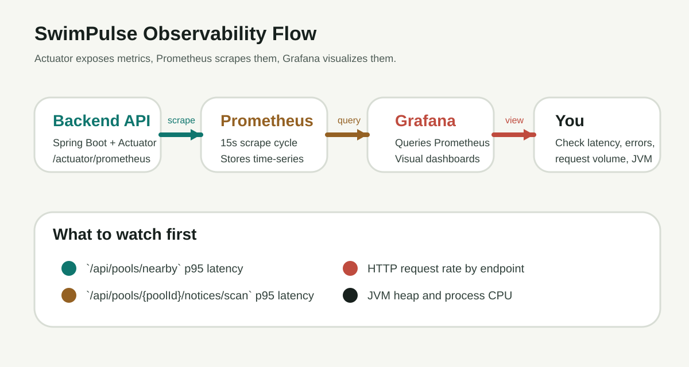
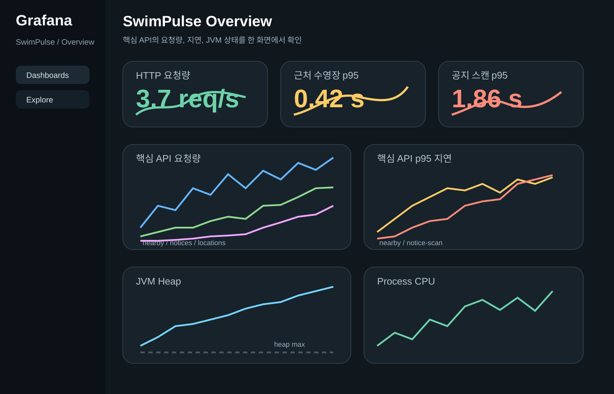

# SwimPulse 성능 측정 매뉴얼

작성일: 2026-06-06

이 문서는 "지금 시스템이 얼마나 느린지", "개선 전후가 얼마나 달라졌는지"를 같은 방식으로 반복 측정하기 위한 실전용 매뉴얼입니다.

관련 개념 설명이 더 필요하면 [002_observability-manual-2026-06-06.md](./002_observability-manual-2026-06-06.md)를 같이 보면 됩니다.



## 1. 무엇을 하는 문서인가

이 문서의 목적은 아래 4가지를 같은 순서로 반복하게 만드는 것입니다.

1. 관측 스택을 올린다.
2. 기준선 데이터를 본다.
3. 같은 시나리오로 부하를 준다.
4. 개선 전후를 같은 지표로 비교한다.

핵심 원칙은 단순합니다.

- 부하를 줄 때마다 같은 조건을 유지합니다.
- 대시보드는 항상 같은 패널을 봅니다.
- 개선 전후는 같은 스크립트로 비교합니다.

## 2. 사용 도구

- Spring Actuator
  애플리케이션 메트릭 노출
- Micrometer
  메트릭 표준 계층
- Prometheus
  메트릭 수집
- Grafana
  메트릭 시각화
- k6
  부하 생성

역할을 한 줄로 정리하면 이렇습니다.

```text
Actuator/Micrometer = 메트릭을 만든다
Prometheus = 메트릭을 모은다
Grafana = 메트릭을 본다
k6 = 일부러 요청을 많이 보낸다
```

## 3. 먼저 스택 올리기

프로젝트 루트에서 아래를 실행합니다.

```powershell
docker compose up -d --build
```

접속 주소는 아래입니다.

- Backend API: `http://localhost:8080`
- Health: `http://localhost:8080/actuator/health`
- Metrics 목록: `http://localhost:8080/actuator/metrics`
- Prometheus scrape endpoint: `http://localhost:8080/actuator/prometheus`
- Prometheus UI: `http://localhost:9090`
- Grafana UI: `http://localhost:3001`

Grafana 기본 로그인:

- ID: `admin`
- Password: `swimpulse-admin`



## 4. 스택이 정상인지 확인

### 1) 백엔드 헬스체크

브라우저에서 아래를 엽니다.

```text
http://localhost:8080/actuator/health
```

정상이면 대략 아래처럼 보입니다.

```json
{
  "status": "UP"
}
```

### 2) Prometheus 타깃 확인

브라우저에서 아래를 엽니다.

```text
http://localhost:9090/targets
```

여기서 `swimpulse-backend`가 `UP`이면 수집이 되고 있는 상태입니다.

### 3) 기본 메트릭 질의

Prometheus `Graph` 탭에서 아래를 넣어 봅니다.

```promql
sum(rate(http_server_requests_seconds_count[5m]))
```

값이 나온다면 HTTP 요청 메트릭이 정상적으로 수집 중입니다.

`p95` 쿼리를 쓰려면 `http_server_requests_seconds_bucket`도 보여야 합니다.

```promql
http_server_requests_seconds_bucket
```

이 값이 안 보이면 HTTP 요청 히스토그램 bucket이 아직 비활성화된 상태일 수 있습니다. 현재 프로젝트는 `application.properties`에서 HTTP 서버 요청 히스토그램과 SLO bucket을 켜두었습니다.

## 5. 무엇을 기준으로 볼 것인가

성능 비교는 평균보다 아래 지표를 우선 봅니다.

- `req/s`
  초당 처리량
- `p95 latency`
  느린 상위 5% 요청의 체감 지연
- `error rate`
  실패 비율
- `CPU`
  계산 부담
- `Heap`
  메모리 압박

특히 지금 프로젝트에서는 아래 두 API가 우선 관찰 대상입니다.

- `/api/pools/nearby`
- `/api/pools/{poolId}/notices/scan`

## 6. Grafana에서 볼 패널

기본 대시보드에서 아래 패널을 우선 봅니다.

- `HTTP Request Rate`
- `Nearby Pools p95 Latency`
- `Notice Scan p95 Latency`
- `Key API Request Rate`
- `JVM Heap Used`
- `Process CPU Usage`

보는 방법은 단순합니다.

- 요청을 안 보낼 때 기준선을 먼저 봅니다.
- 테스트를 시작한 뒤 패널이 얼마나 뛰는지 봅니다.
- 코드 수정 후 같은 테스트를 다시 돌려 비교합니다.

## 7. 성능 테스트 절차

### 1) 기준선 측정

아무 부하를 주지 않은 상태에서 3분 정도 대시보드를 봅니다.

기록해두면 좋은 값:

- `/api/pools/nearby` p95
- `/api/pools/{poolId}/notices/scan` p95
- 전체 req/s
- CPU 평균 범위
- Heap 사용 범위

### 2) 단일 사용자 체감 확인

프론트에서 직접 아래 동작을 몇 번 반복합니다.

1. 근처 수영장 조회
2. 특정 수영장 공지 확인

이 단계는 "실사용 체감"을 보는 용도입니다.

### 3) 반복 요청 부하 확인

그다음 같은 요청을 반복적으로 보내서 API가 얼마나 버티는지 봅니다.

이때 `k6`를 쓰는 게 가장 편합니다.

`k6`는 부하 가정 스크립트라고 이해하면 거의 맞습니다.

- 어떤 URL을
- 몇 명이 동시에
- 얼마나 오래
- 어떤 간격으로 때릴지

를 스크립트로 정의하는 도구입니다.

### 4) 개선 후 같은 테스트 재실행

코드 변경 후에는 반드시 같은 시나리오를 다시 돌립니다.

비교 포인트는 아래입니다.

- p95가 내려갔는가
- req/s가 올라갔는가
- CPU가 덜 튀는가
- 에러율이 줄었는가

## 8. 추천 진행 방식

실무에서는 보통 아래 형태로 많이 진행합니다.

1. Grafana 대시보드를 열어 둡니다.
2. Prometheus나 애플리케이션 헬스를 먼저 확인합니다.
3. `k6` 스크립트를 실행합니다.
4. Grafana에서 p95, req/s, CPU, Heap을 실시간으로 봅니다.
5. 결과를 기록합니다.
6. 코드 최적화 후 같은 스크립트를 다시 실행합니다.
7. 전후 수치를 나란히 비교합니다.

즉 질문한 것처럼 "Grafana를 열어두고 스크립트를 실행하면서 보는 방식"이 일반적인 운영 흐름에 가깝습니다.

## 9. Prometheus에서 바로 써볼 쿼리

### 전체 요청량

```promql
sum(rate(http_server_requests_seconds_count[5m]))
```

### actuator 제외 전체 요청량

```promql
sum(rate(http_server_requests_seconds_count{uri!~"/actuator.*"}[1m]))
```

### 근처 수영장 API p95

```promql
histogram_quantile(
  0.95,
  sum by (le) (
    rate(http_server_requests_seconds_bucket{uri="/api/pools/nearby"}[5m])
  )
)
```

### 공지 스캔 API p95

```promql
histogram_quantile(
  0.95,
  sum by (le) (
    rate(http_server_requests_seconds_bucket{uri="/api/pools/{poolId}/notices/scan"}[5m])
  )
)
```

### 5xx 에러 비율

```promql
sum(rate(http_server_requests_seconds_count{status=~"5.."}[5m]))
/
sum(rate(http_server_requests_seconds_count[5m]))
```

### URI별 p95 지연

```promql
histogram_quantile(
  0.95,
  sum by (uri, le) (
    rate(http_server_requests_seconds_bucket{uri!~"/actuator.*"}[1m])
  )
)
```

이 쿼리는 "지금 시점 기준 최근 1분 동안 어떤 URI가 느렸는지"를 보는 데 좋습니다.

### 느린 API 상위 5개

```promql
topk(
  5,
  histogram_quantile(
    0.95,
    sum by (uri, le) (
      rate(http_server_requests_seconds_bucket{uri!~"/actuator.*"}[5m])
    )
  )
)
```

### URI별 평균 응답시간

```promql
sum by (uri) (
  rate(http_server_requests_seconds_sum{uri!~"/actuator.*"}[5m])
)
/
sum by (uri) (
  rate(http_server_requests_seconds_count{uri!~"/actuator.*"}[5m])
)
```

### URI별 요청량

```promql
sum by (uri) (
  rate(http_server_requests_seconds_count{uri!~"/actuator.*"}[1m])
)
```

### 4xx 에러 비율

```promql
sum(rate(http_server_requests_seconds_count{status=~"4..",uri!~"/actuator.*"}[5m]))
/
sum(rate(http_server_requests_seconds_count{uri!~"/actuator.*"}[5m]))
```

### URI별 5xx 에러 수

```promql
sum by (uri) (
  rate(http_server_requests_seconds_count{status=~"5..",uri!~"/actuator.*"}[5m])
)
```

### Hikari 활성 커넥션

```promql
hikaricp_connections_active{application="SwimPulse"}
```

### Hikari 대기 커넥션

```promql
hikaricp_connections_pending{application="SwimPulse"}
```

### GC pause rate

```promql
sum(rate(jvm_gc_pause_seconds_count{application="SwimPulse"}[5m]))
```

## 10. 지금 프로젝트에 맞는 테스트 시나리오

### 시나리오 A. 위치 기반 조회

목적:
`/api/pools/nearby`가 느린지, 거리 계산이나 후보 선정이 병목인지 확인

방법:

1. 같은 좌표로 반복 조회
2. 반경을 조금씩 키워가며 조회
3. p95와 CPU를 비교

보면 좋은 점:

- 반경이 커질수록 p95가 얼마나 오르는지
- 후보 풀이 커질 때 CPU가 얼마나 튀는지

### 시나리오 B. 공지 스캔 조회

목적:
실제 크롤링과 파싱이 병목인지 확인

방법:

1. 같은 `poolId`로 반복 요청
2. 서로 다른 `poolId`로도 요청
3. 락에 의해 중복 스캔이 차단되는지 확인

보면 좋은 점:

- 첫 요청과 후속 요청의 시간 차이
- 스캔 중 중복 요청이 어떻게 응답하는지
- CPU와 p95가 얼마나 튀는지

### 시나리오 C. 개선 전후 비교

예를 들어 아래 같은 개선을 했다면:

- 공지 선행 수집
- 위치 조회 bounding box 적용
- 결과 캐시 추가

같은 `k6` 스크립트를 다시 돌려서 아래를 비교합니다.

- p95 감소폭
- 처리량 증가폭
- CPU 감소폭

## 11. 처음 쓸 때 보통 어떻게 진행하나

처음에는 아래 순서로 많이 봅니다.

1. Grafana에서 전체 요청량, URI별 요청량, URI별 p95 패널을 먼저 만듭니다.
2. 아무것도 안 할 때 기준선을 2~3분 봅니다.
3. 프론트에서 실제로 기능을 눌러봅니다.
4. 어느 URI가 튀는지 확인합니다.
5. 그다음 `k6`로 같은 API를 반복 호출합니다.
6. `요청량은 높은데 p95도 같이 뛰는지`, `에러율이 오르는지`, `DB 커넥션이 막히는지`를 같이 봅니다.

쉽게 말하면:

- `count/rate`: 얼마나 많이 호출됐는지
- `bucket + histogram_quantile`: 얼마나 느렸는지
- `status`: 실패했는지
- `cpu/heap/hikari`: 병목이 어디 쪽인지

예를 들어:

- `/api/pools/nearby`만 p95가 높고 CPU도 같이 튄다
  위치 계산/후보 필터 쪽 의심
- `/api/pools/{poolId}/notices/scan`만 느리고 외부 호출 때만 튄다
  크롤링/파싱/외부 사이트 응답 의심
- 전체 API가 느리고 `hikaricp_connections_pending`이 오른다
  DB 커넥션 부족이나 느린 쿼리 의심

## 12. 결과 기록 템플릿

테스트할 때는 아래 형식으로 남기면 비교가 편합니다.

```text
일시:
브랜치/커밋:
대상 API:
시나리오:
가상 사용자 수:
지속 시간:

변경 전
- req/s:
- p95:
- error rate:
- CPU:
- heap:

변경 후
- req/s:
- p95:
- error rate:
- CPU:
- heap:

해석
- 무엇이 좋아졌는지:
- 아직 병목이 남았는지:
```

## 13. 자주 헷갈리는 포인트

### `k6`는 무엇인가

부하 가정 스크립트 도구라고 보면 됩니다.

정확히는:

- API에 원하는 패턴으로 트래픽을 발생시키고
- 그 결과를 수치로 보여주는 부하 테스트 도구입니다.

### Grafana만 보면 충분한가

아닙니다.

- Grafana는 "상태를 보는 창"이고
- `k6`는 "일부러 상황을 만드는 도구"입니다.

둘을 같이 써야 전후 비교가 쉬워집니다.

### 개선 전후를 어떻게 비교하나

반드시 같은 조건으로 다시 돌려야 합니다.

- 같은 API
- 같은 요청 수
- 같은 지속 시간
- 같은 데이터 상태

이 네 가지가 달라지면 수치 비교가 흐려집니다.

### bucket을 켜면 시간별로 뭐가 느린지 보이나

네, "최근 1분", "최근 5분" 같은 시간 구간 기준으로 어떤 URI가 느렸는지 볼 수 있습니다.

다만 bucket이 알려주는 것은:

- 어느 API가 느렸는지
- 얼마나 느렸는지
- 언제 느려졌는지

까지입니다.

bucket만으로는 "정확히 코드 내부 어느 함수가 느린지"까지는 안 보입니다. 그건 필요하면 커스텀 Micrometer 타이머를 추가해서 더 쪼개야 합니다.

## 14. 다음 추천 작업

이 문서를 실제로 더 잘 쓰려면 다음이 있으면 좋습니다.

- 저장소에 `k6` 스크립트 추가
- `/api/pools/nearby` 전용 시나리오 추가
- `/api/pools/{poolId}/notices/scan` 전용 시나리오 추가
- 테스트 결과를 `reports/`에 누적 저장
