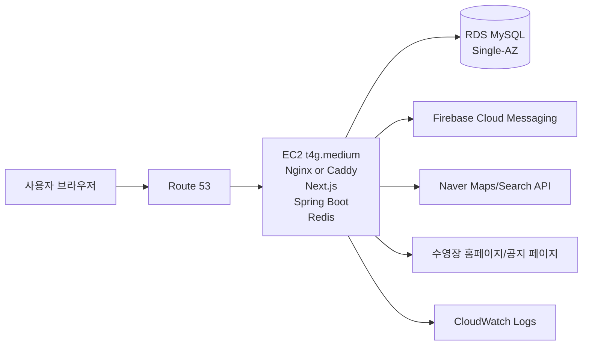
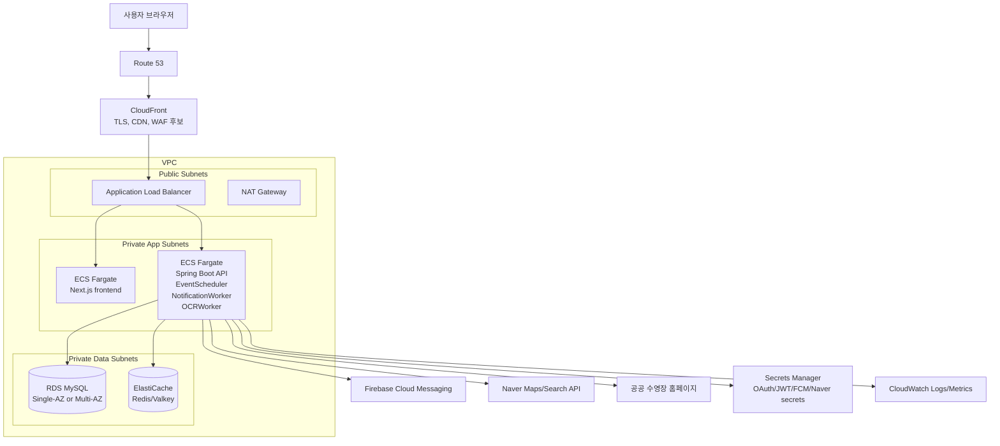

# SwimPulse AWS 배포 아키텍처 및 월 비용 추정

작성일: 2026-06-25  
기준 리전: `ap-northeast-2` Asia Pacific (Seoul)  
계산 기준: 1개월 730시간 상시 구동, 온디맨드, 세금 제외, USD 기준

## 목적

현재 SwimPulse 프로젝트를 AWS에 올린다고 가정했을 때의 배포 아키텍처를 정리한다.

이 문서는 세 가지를 목표로 한다.

1. 현재 프로젝트 구조를 AWS 구성 요소로 매핑한다.
2. 실제로 올릴 수 있는 비용 절감형 구조와 포트폴리오에 보여주기 좋은 완성형 구조를 구분한다.
3. 1개월 내내 켜두었을 때의 대략적인 월 비용을 산정한다.

## 현재 프로젝트 구조 요약

현재 로컬 실행 구조는 다음과 같다.

```text
Browser
  -> Next.js frontend
  -> /api/* rewrite
  -> Spring Boot backend
      -> MySQL
      -> Redis
      -> Firebase Cloud Messaging
      -> Naver Maps/Search API
      -> public pool websites crawling
      -> Tesseract OCR

Observability:
  -> Spring Actuator /prometheus
  -> Prometheus
  -> Grafana

Load test:
  -> k6
```

현재 `docker-compose.yml` 기준 컨테이너는 다음이다.

| 구성 | 역할 |
|---|---|
| `backend` | Spring Boot API, OAuth, scheduler, notification worker, OCR worker |
| `redis` | cache, single-flight lock, notification queue, OCR queue |
| `prometheus` | backend actuator metric scrape |
| `grafana` | 운영/성능 대시보드 |
| `k6` | 부하 테스트 |

프론트엔드는 Next.js이며 `npm run build`, `npm run start`로 운영 가능하다. 백엔드는 Dockerfile 안에서 Java 21 JRE와 Tesseract OCR 패키지를 같이 설치한다.

## AWS 매핑

| 현재 구성 | AWS 배포 후보 | 비고 |
|---|---|---|
| Next.js frontend | EC2, ECS Fargate, Amplify, CloudFront | SSR/rewrites가 있으므로 컨테이너 운영이 가장 단순 |
| Spring Boot backend | EC2 또는 ECS Fargate | scheduler/worker가 같은 프로세스에 포함됨 |
| MySQL | Amazon RDS for MySQL | 운영 DB는 EC2 내장보다 RDS 권장 |
| Redis | ElastiCache for Redis/Valkey 또는 EC2 Redis | 운영 안정성은 ElastiCache가 좋음 |
| Firebase service account | Secrets Manager / SSM Parameter Store | 파일 mount 대신 secret 주입 |
| OAuth/JWT/Naver API keys | Secrets Manager / SSM Parameter Store | `.env` 직접 배포 금지 |
| Prometheus/Grafana | CloudWatch, Amazon Managed Prometheus/Grafana, 또는 EC2 자체 운영 | 초기 비용은 CloudWatch 중심이 낮음 |
| k6 | 로컬/CI에서 실행 | 상시 운영 대상 아님 |

## 비용 절감형 AWS 구조

가장 현실적인 첫 배포 구조는 EC2 1대에 프론트/백엔드/Redis를 같이 올리고, DB만 RDS로 분리하는 방식이다.

이 구조는 운영 복잡도와 비용이 낮다. 대신 서버 1대 장애 시 프론트/백엔드/Redis가 같이 내려간다.



### 권장 스펙

| 항목 | 권장 |
|---|---|
| EC2 | `t4g.medium` Linux/ARM, 2 vCPU, 4 GiB |
| DB | RDS MySQL `db.t4g.micro`, Single-AZ |
| Redis | EC2 내부 Redis 컨테이너 |
| Storage | EC2 gp3 30GB, RDS gp3 20GB |
| TLS | Caddy/Let's Encrypt 또는 ALB/ACM |
| Monitoring | CloudWatch Logs + Spring Actuator |

`t4g.small`도 가능하지만, Java + Next.js + Redis + Tesseract OCR을 한 서버에서 같이 돌리면 메모리 2 GiB는 빠듯하다. 비용만 보면 `t4g.small`이 좋지만, 실제 상시 운영은 `t4g.medium`부터가 덜 불안하다.

### 월 비용 추정

| 항목 | 단가 | 계산 | 월 비용 |
|---|---:|---:|---:|
| EC2 `t4g.medium` | $0.0416/h | 730h | $30.37 |
| EC2 public IPv4 | $0.005/h | 730h | $3.65 |
| EC2 EBS gp3 30GB | $0.0912/GB-month | 30GB | $2.74 |
| RDS MySQL `db.t4g.micro` | $0.025/h | 730h | $18.25 |
| RDS gp3 20GB | $0.131/GB-month | 20GB | $2.62 |
| Route 53 hosted zone | $0.50/month | 1 zone | $0.50 |
| CloudWatch Logs | 약 $0.76/GB ingest | 2GB ingest 가정 | $1.52 |
| 합계 |  |  | **약 $59.65/month** |

한화 환산을 1 USD = 1,400 KRW로 잡으면 약 83,500원/month 정도다. 환율, 세금, 로그량, 트래픽에 따라 달라진다.

### 더 싼 실험용 변형

`t4g.small`을 쓰면 EC2 비용이 약 $15.18/month로 내려간다.

```text
t4g.small 사용 시 총액:
$59.65 - $30.37 + $15.18 = 약 $44.46/month
```

다만 OCR과 Java heap 때문에 성능 테스트나 관리자 대시보드를 같이 켜면 메모리 압박이 생길 수 있다.

## 포트폴리오용 완성형 AWS 구조

포트폴리오에 보여주기 좋은 구조는 컨테이너 기반 ECS/Fargate 구성이다.

이 구조는 “프론트”, “백엔드 API/worker”, “DB”, “Redis”, “관측”, “비밀 관리”가 분리되어 아키텍처 설명이 좋다. 비용은 EC2 1대 구조보다 올라간다.



### 핵심 설계 포인트

| 영역 | 설계 |
|---|---|
| 프론트 | Next.js를 별도 ECS 서비스로 운영 |
| 백엔드 | Spring Boot 컨테이너 1개에 API, scheduler, worker 포함 |
| Redis | ElastiCache로 분리해 queue/cache 유실 위험 축소 |
| DB | RDS MySQL로 백업, 스냅샷, 장애 대응 기반 확보 |
| 외부 호출 | backend가 Naver API, FCM, 공지 사이트로 outbound |
| 비밀값 | Secrets Manager 또는 SSM Parameter Store |
| 관측 | CloudWatch Logs, Actuator metrics, 필요 시 Prometheus/Grafana |
| 배포 | GitHub Actions -> ECR -> ECS rolling deploy |

### 월 비용 추정: 완성형 starter

Fargate는 서울 리전 ARM 기준으로 계산했다.

| 항목 | 단가 | 계산 | 월 비용 |
|---|---:|---:|---:|
| Fargate backend | 1 vCPU + 2GB | `(1*$0.03725 + 2*$0.00409) * 730` | $33.16 |
| Fargate frontend | 0.5 vCPU + 1GB | `(0.5*$0.03725 + 1*$0.00409) * 730` | $16.58 |
| ALB hourly | $0.0225/h | 730h | $16.43 |
| ALB LCU | $0.008/LCU-h | 1 LCU 가정 | $5.84 |
| Public IPv4 | $0.005/IP-h | ALB 2개 + NAT 1개 | $10.95 |
| NAT Gateway | $0.059/h | 1개, 730h | $43.07 |
| NAT data processing | $0.059/GB | 20GB 가정 | $1.18 |
| RDS MySQL `db.t4g.micro` | $0.025/h | 730h | $18.25 |
| RDS gp3 20GB | $0.131/GB-month | 20GB | $2.62 |
| ElastiCache Valkey `cache.t4g.micro` | $0.0192/h | 730h | $14.02 |
| Route 53 hosted zone | $0.50/month | 1 zone | $0.50 |
| CloudWatch Logs | $0.76/GB ingest | 5GB ingest 가정 | $3.80 |
| CloudWatch log storage | $0.0314/GB-month | 5GB 보관 가정 | $0.16 |
| Secrets Manager | 약 $0.40/secret-month | 4개 가정 | $1.60 |
| ECR/S3 기타 | 소량 | 이미지/정적 리소스 | $1.00 |
| 합계 |  |  | **약 $169.16/month** |

한화 환산을 1 USD = 1,400 KRW로 잡으면 약 236,800원/month 정도다.

### 완성형 비용이 올라가는 이유

가장 큰 차이는 NAT Gateway와 ALB다.

| 요소 | 이유 |
|---|---|
| NAT Gateway | private subnet의 ECS task가 외부 공지 사이트, Naver API, FCM으로 나가야 해서 필요 |
| ALB | ECS 서비스를 안정적으로 외부에 노출하고 health check, TLS, routing 제공 |
| ElastiCache | Redis를 애플리케이션 서버에서 분리 |
| Fargate | 서버 관리가 줄지만 EC2보다 24시간 상시 비용은 높음 |

NAT Gateway는 작은 프로젝트에서 체감 비용이 크다. 비용을 줄이려면 아래 중 하나를 선택해야 한다.

| 방법 | 비용 | 트레이드오프 |
|---|---:|---|
| private subnet + NAT Gateway | 높음 | 보안/운영 표준에 가까움 |
| ECS task public subnet 배치 | 낮음 | 보안그룹 관리가 중요하고 포트 노출 실수 주의 |
| EC2 단일 서버 | 낮음 | 장애 격리와 확장성이 약함 |
| NAT instance | 중간 | 직접 운영/패치 필요 |

## 운영 규모별 추천

### 1단계: 실제 배포 시작

추천 구조:

```text
EC2 t4g.medium + RDS db.t4g.micro + EC2 Redis
```

이유:

1. 월 비용이 낮다.
2. 현재 프로젝트 구조와 가장 잘 맞는다.
3. Docker Compose를 큰 변경 없이 올릴 수 있다.
4. 사용자 수가 적은 초기 서비스에는 충분하다.

단점:

1. EC2 장애 시 프론트/백엔드/Redis가 같이 영향받는다.
2. Redis queue/cache가 EC2에 묶인다.
3. 배포 자동화와 오토스케일링은 직접 구성해야 한다.

### 2단계: 포트폴리오/운영 안정성 강화

추천 구조:

```text
ECS Fargate + ALB + RDS + ElastiCache + CloudWatch + Secrets Manager
```

이유:

1. 서비스 구성 요소가 명확히 분리된다.
2. 장애 격리와 배포 설명이 좋다.
3. 관리형 DB/Redis로 운영 리스크가 줄어든다.
4. 포트폴리오에서 “컨테이너 기반 운영 구조”를 설명하기 좋다.

단점:

1. 월 비용이 2~3배 오른다.
2. NAT Gateway 비용이 생각보다 크다.
3. ECS, IAM, VPC, ALB, Secrets 설정이 추가된다.

### 3단계: 트래픽 증가 후 확장

확장 후보:

```text
backend ECS service 2 tasks
RDS db.t4g.small 이상
ElastiCache replication group
RDS Multi-AZ
CloudFront + WAF
Managed Prometheus/Grafana
```

대략 비용은 starter 완성형에서 $100~$200 이상 추가될 수 있다. 특히 RDS Multi-AZ, NAT Gateway 다중 AZ, Managed Grafana/Prometheus는 비용이 빠르게 늘 수 있다.

## 포트폴리오에 쓸 수 있는 아키텍처 설명

포트폴리오에는 다음 구조가 가장 보기 좋다.

```text
사용자 요청
  -> CloudFront/ALB
  -> Next.js frontend
  -> Spring Boot API
  -> MySQL/RDS
  -> Redis queue/cache

공지 확인
  -> Spring Boot crawler
  -> 공공기관 공지 HTML 파싱
  -> 이미지 OCR은 Redis queue에 비동기 등록
  -> OCR worker가 백그라운드 처리
  -> 결과 DB 반영

알림 발송
  -> EventScheduler가 due registration_events 조회
  -> notifications row 생성
  -> DB commit 이후 Redis queue publish
  -> NotificationWorker가 Redis pop
  -> FCM 발송
  -> SENT/FAILED 저장

운영 관리
  -> Admin Dashboard
  -> queue length, delivery lag, failed notification, OCR 상태 확인
  -> failed/stale 알림 재큐잉
  -> 시설 추가 요청 승인/후처리
```

포트폴리오 문장 예시:

> SwimPulse는 수영장 공지 크롤링, OCR 기반 모집 기간 추출, 사용자 구독, FCM 알림을 하나의 서비스 흐름으로 연결한 웹 애플리케이션입니다. Spring Boot는 API와 scheduler/worker를 담당하고, Redis는 cache와 queue를 담당합니다. 알림은 DB row를 source of truth로 두고 commit 이후 Redis에 publish하여 queue와 DB 정합성을 보강했습니다. AWS 배포 시에는 ECS Fargate, RDS MySQL, ElastiCache, ALB, CloudWatch 기반으로 구성하여 API, worker, DB, queue, 관측 영역을 분리할 수 있습니다.

## 비용 산정 기준과 출처

가격은 2026-06-25 기준 AWS 공식 가격 페이지와 AWS Price List Bulk API로 확인했다.

주요 산정값:

| 항목 | 서울 리전 기준 단가 |
|---|---:|
| EC2 `t4g.small` Linux | $0.0208/h |
| EC2 `t4g.medium` Linux | $0.0416/h |
| RDS MySQL `db.t4g.micro` Single-AZ | $0.025/h |
| RDS MySQL `db.t4g.small` Single-AZ | $0.051/h |
| RDS gp3 storage | $0.131/GB-month |
| EBS gp3 storage | $0.0912/GB-month |
| ElastiCache Redis `cache.t4g.micro` | $0.024/h |
| ElastiCache Valkey `cache.t4g.micro` | $0.0192/h |
| Fargate ARM vCPU | $0.03725/vCPU-hour |
| Fargate ARM memory | $0.00409/GB-hour |
| ALB | $0.0225/h + $0.008/LCU-hour |
| NAT Gateway | $0.059/h + $0.059/GB |
| Public IPv4 | $0.005/IP-hour |
| Route 53 hosted zone | $0.50/month |
| CloudWatch Logs ingest | $0.76/GB |
| CloudWatch Logs storage | $0.0314/GB-month |

참고:

- AWS EC2 On-Demand pricing: https://aws.amazon.com/ec2/pricing/on-demand/
- AWS RDS for MySQL pricing: https://aws.amazon.com/rds/mysql/pricing/
- AWS ElastiCache pricing: https://aws.amazon.com/elasticache/pricing/
- AWS Elastic Load Balancing pricing: https://aws.amazon.com/elasticloadbalancing/pricing/
- AWS Fargate pricing: https://aws.amazon.com/fargate/pricing/
- AWS Route 53 pricing: https://aws.amazon.com/route53/pricing/
- AWS EBS pricing: https://aws.amazon.com/ebs/pricing/
- AWS VPC pricing: https://aws.amazon.com/vpc/pricing/
- AWS Price List Bulk API 문서: https://docs.aws.amazon.com/awsaccountbilling/latest/aboutv2/using-the-aws-price-list-bulk-api-fetching-price-list-files-manually.html

## 제외한 비용

아래 비용은 사용량에 따라 크게 달라져 이번 산정에서 고정 비용으로 넣지 않았다.

| 항목 | 이유 |
|---|---|
| 데이터 전송량 | 월 100GB 이하라면 AWS 전체 outbound free allowance 영향 가능 |
| Naver Maps/Search API | 외부 API 과금 정책에 따름 |
| OpenAI API | OCR 이후 보강/LLM 사용량에 따라 별도 |
| Firebase Cloud Messaging | FCM 자체는 보통 무료지만, Firebase/GCP 부가 기능 사용 시 별도 |
| 도메인 구매비 | `.com`, `.kr` 등 TLD별로 다름 |
| Managed Grafana/Prometheus | 초기에는 CloudWatch 또는 자체 Grafana로 대체 가능 |
| WAF | 보안 강화 시 추가 |

## 개선 사항

AWS 배포 전에 추가하면 좋은 항목은 다음이다.

### 1. Secret 관리

현재 로컬 `.env`에는 OAuth, JWT, Naver API, Firebase 경로 같은 민감 값이 들어간다. AWS에서는 다음으로 옮기는 것이 좋다.

```text
Secrets Manager:
  - GOOGLE_CLIENT_SECRET
  - SWIMPULSE_JWT_SECRET
  - NAVER_*_SECRET
  - Firebase service account JSON

SSM Parameter Store:
  - 일반 설정값
  - scheduler interval
  - worker batch size
```

### 2. 배포 자동화

추천 흐름:

```text
GitHub Actions
  -> backend Docker build
  -> frontend Docker build
  -> ECR push
  -> ECS service deploy
  -> health check
```

### 3. Scheduler/Worker 분리

현재는 Spring Boot 하나에 API와 scheduler/worker가 같이 있다. 트래픽이 늘면 다음처럼 분리할 수 있다.

```text
backend-api service
notification-worker service
notice-ocr-worker service
event-scheduler service
```

장점:

1. API 트래픽과 worker 부하를 분리할 수 있다.
2. OCR worker만 CPU/메모리를 키울 수 있다.
3. scheduler는 1개만 실행되도록 더 명확히 관리할 수 있다.

### 4. Redis Queue 고도화

현재는 Redis List + DB 상태 관리로 충분하다. 운영 규모가 커지면 다음을 고려한다.

```text
Redis Stream:
  - consumer group
  - pending entry 관리

RabbitMQ:
  - ack/nack
  - retry queue
  - DLQ
  - routing key
```

### 5. CloudFront/WAF

관리자 페이지와 OAuth callback이 있으므로 운영 배포에서는 다음이 좋다.

1. CloudFront 앞단 TLS 종료
2. ALB origin 연결
3. WAF managed rules
4. `/admin` 접근 제한 강화
5. rate limiting

### 6. DB 백업/복구 점검

RDS를 쓰더라도 아래를 확인해야 한다.

1. automated backup retention
2. snapshot 복구 리허설
3. Flyway migration rollback 전략
4. DB parameter group timezone/charset

### 7. 비용 알림

작은 프로젝트일수록 NAT Gateway, public IPv4, 로그 수집비가 예상보다 크게 보일 수 있다.

권장:

```text
AWS Budgets:
  - $50 경고
  - $100 경고
  - $200 경고

Cost Explorer:
  - NAT Gateway
  - Public IPv4
  - CloudWatch Logs
  - RDS
```

## 결론

지금 당장 실제로 AWS에 올린다면 `EC2 t4g.medium + RDS MySQL + EC2 Redis` 구조가 가장 현실적이다. 월 비용은 약 $60 수준으로 예상된다.

포트폴리오에 보여줄 완성형 구조는 `ECS Fargate + ALB + RDS + ElastiCache + CloudWatch + Secrets Manager`가 좋다. 구조가 명확하고 운영 설계 설명이 쉽다. 다만 NAT Gateway와 ALB 때문에 월 비용은 약 $170 수준으로 올라간다.

따라서 추천 순서는 다음이다.

```text
1. 비용 절감형 EC2/RDS로 실제 배포 경험 확보
2. Docker image/ECR/GitHub Actions로 배포 자동화
3. RDS/Redis/CloudWatch 운영 지표 확인
4. 포트폴리오에는 ECS/Fargate 완성형 목표 아키텍처까지 함께 제시
5. 실제 사용자가 늘면 ECS/ElastiCache/RDS Multi-AZ로 단계적 전환
```
