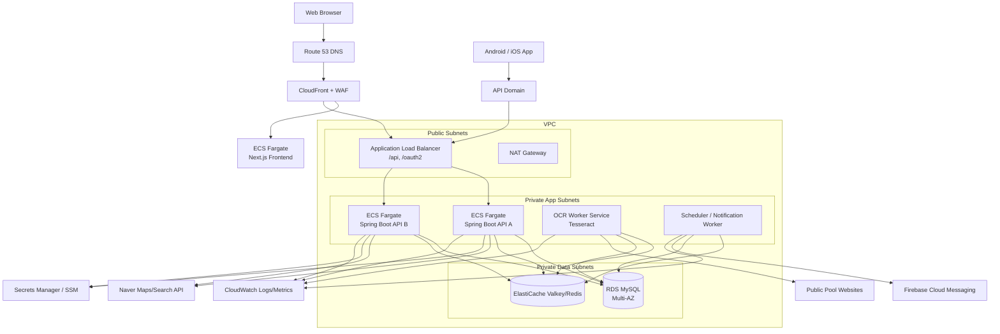
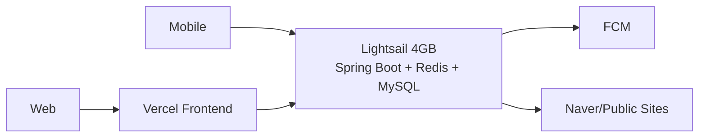
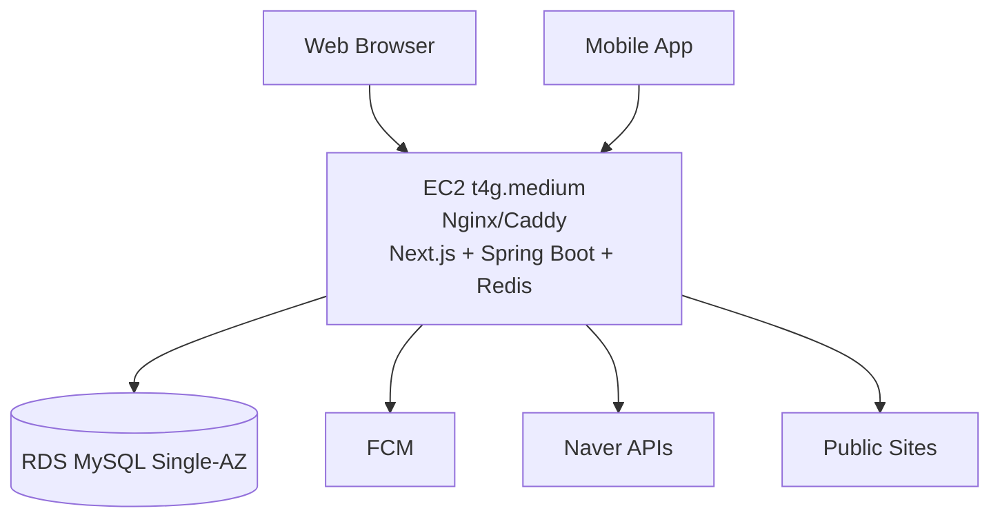
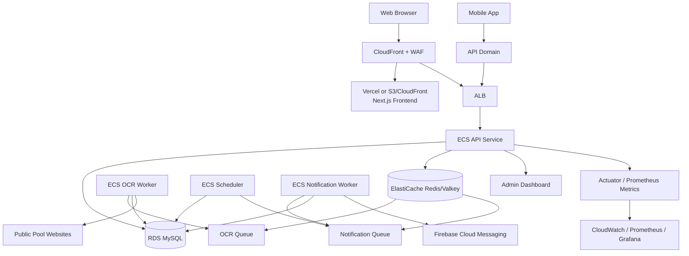

# 038 SwimPulse Cloud 배포 아키텍처 제안서

작성일: 2026-07-03

## 목적

SwimPulse는 Next.js 웹 프론트엔드, React Native 모바일 앱, Spring Boot API, MySQL, Redis queue/cache, 공공기관 공지 크롤링, OCR worker, FCM 알림, 관리자 대시보드로 구성되어 있다.

이 보고서는 SwimPulse를 AWS 또는 유사 클라우드에 올릴 때 선택할 수 있는 아키텍처를 세 단계로 정리한다.

1. 근본적인 운영 아키텍처
2. 비용 절감 아키텍처
3. 포트폴리오 완성도를 높이는 개선 아키텍처

정확한 비용은 리전, 트래픽, 환율, 로그량, 데이터 전송량, 예약/절감 플랜 여부에 따라 달라진다. 여기서는 2026년 7월 3일 기준 공개 가격 정보를 참고해 “비용 구조와 줄이는 방향” 중심으로 정리한다.

## 현재 프로젝트 기준

현재 코드와 설정상 클라우드 배포에서 고려해야 할 구성은 다음과 같다.

| 영역 | 현재 구현 | 클라우드 매핑 |
|---|---|---|
| Web Frontend | Next.js 16, React 19 | Vercel, EC2/Lightsail Nginx, ECS/Fargate, CloudFront |
| Mobile App | React Native CLI, Android 우선 | 앱 스토어/플레이스토어 배포, API/FCM만 클라우드 연결 |
| Backend | Spring Boot, Java 21, Docker | EC2 Docker Compose, Lightsail, ECS/Fargate, App Runner |
| DB | MySQL, Flyway migration | RDS MySQL, Lightsail managed MySQL, EC2 내부 MySQL |
| Redis | Redis cache, single-flight lock, notification queue, OCR queue | ElastiCache/Valkey, Lightsail/EC2 Redis |
| Notification | FCM, browser push, mobile push | Firebase Cloud Messaging, HTTPS API |
| Crawler/OCR | 공공기관 사이트 크롤링, Tesseract OCR | backend container에 Tesseract 포함, worker 분리 가능 |
| Auth | Google OAuth, JWT cookie, mobile Bearer JWT | HTTPS, OAuth callback domain, secure cookie, mobile token storage |
| Admin | 운영/서비스 관리자 대시보드 | `/admin`, ROLE_ADMIN, WAF/IP 제한 후보 |
| Observability | Actuator, Prometheus, Grafana | CloudWatch, self-hosted Prometheus/Grafana, AMP/AMG |
| Load Test | k6 | 로컬/CI 실행, 결과 S3 또는 repo 보관 |

현재 `docker-compose.yml` 기준 상시 운영 후보는 다음이다.

| 컨테이너 | 역할 |
|---|---|
| `backend` | API, OAuth, scheduler, notification worker, OCR worker |
| `redis` | Redis queue/cache |
| `prometheus` | backend actuator scrape |
| `grafana` | 운영/성능 대시보드 |
| `k6` | 부하 테스트 profile |

프론트엔드는 별도 `frontend/` Next.js 앱이고, 모바일은 `mobile/` React Native 앱이다. 모바일 앱은 서버에서 호스팅되는 것이 아니라, 설치된 앱이 백엔드 API와 FCM에 연결된다.

## 월 비용 추정 기준

공통 가정:

- 1개월 = 730시간
- 환율 = `1 USD = 1,400 KRW`
- 신규 계정 Free Tier, 크레딧, Savings Plans, Reserved Instance 미적용
- 소규모 포트폴리오/초기 서비스 트래픽 기준
- 데이터 전송량, CloudWatch 로그량, 외부 API 호출량은 실제 사용량에 따라 변동

공개 가격 확인 요약:

| 항목 | 2026-07-03 기준 참고 |
|---|---|
| Vercel Hobby | `$0/mo`, 개인 프로젝트에 적합, Fast Data Transfer 100GB/month 포함 |
| Vercel Pro | `$20/mo`부터, 1TB Fast Data Transfer, 10M Edge Requests 포함, 초과 사용량 과금 |
| Lightsail Linux with public IPv4 2GB | `$12/mo`, 2 vCPU, 2GB RAM, 60GB SSD, 3TB transfer |
| Lightsail Linux with public IPv4 4GB | `$24/mo`, 2 vCPU, 4GB RAM, 80GB SSD, 4TB transfer |
| Lightsail Managed DB 1GB | `$15/mo`, 1GB RAM, 40GB SSD, 100GB transfer |
| Lightsail Load Balancer | `$18/mo` |
| Fly.io shared-cpu-2x 4GB | 약 `$21.40/mo` |
| AWS ECS/Fargate/RDS/ElastiCache | 리전/스펙별 과금, 관리형 운영 구조는 고정비가 큼 |

## 아키텍처별 구성 / 월 비용 표

아래 표는 항목별 월 비용이 큰 순서대로 정렬했다. 정확한 청구액은 리전, 트래픽, 로그량, 스토리지, public IPv4 수, 환율에 따라 달라질 수 있다.

### 1안. 근본적인 운영 아키텍처

API 2개, OCR worker, scheduler/notification worker, RDS Multi-AZ, ElastiCache, ALB, NAT Gateway를 둔 운영형 구조다.

| 구성 | 월 비용 |
|---|---:|
| ECS Fargate API 2 tasks | `$66.32`, 약 `92,848원` |
| NAT Gateway 1개 | `$43.07`, 약 `60,298원` |
| RDS MySQL Multi-AZ `db.t4g.micro` + 20GB | `$39.12`, 약 `54,768원` |
| ECS Fargate OCR worker | `$33.16`, 약 `46,424원` |
| ALB + 1 LCU | `$22.27`, 약 `31,178원` |
| ECS Fargate scheduler/notification worker | `$16.58`, 약 `23,212원` |
| ElastiCache Valkey `cache.t4g.micro` | `$14.02`, 약 `19,628원` |
| Public IPv4 | `$10.95`, 약 `15,330원` |
| CloudWatch Logs/Metrics 버퍼 | `$5.00`, 약 `7,000원` |
| Route 53 hosted zone | `$0.50`, 약 `700원` |
| **합계** | **`$250.99`, 약 `351,386원`** |

### 2안-A. 비용 절감 아키텍처: Vercel + Lightsail + Managed MySQL

프론트는 Vercel, 백엔드와 Redis는 Lightsail, DB는 Lightsail Managed MySQL로 분리하는 현실적인 저비용 운영 구조다.

| 구성 | 월 비용 |
|---|---:|
| Lightsail Linux 4GB | `$24.00`, 약 `33,600원` |
| Lightsail Managed MySQL 1GB | `$15.00`, 약 `21,000원` |
| Snapshot/log buffer | `$5.00`, 약 `7,000원` |
| Vercel Hobby | `$0.00`, 약 `0원` |
| **합계: Vercel Hobby 기준** | **`$44.00`, 약 `61,600원`** |

Vercel Pro를 쓰는 경우는 아래처럼 추가된다.

| 구성 | 월 비용 |
|---|---:|
| Vercel Pro 선택 시 추가 | `+$20.00`, 약 `28,000원` |
| **합계: Vercel Pro 기준** | **`$64.00`, 약 `89,600원`** |

### 2안-B. 최저 비용 아키텍처: Vercel + Lightsail 단일 서버

프론트만 Vercel에 두고, Spring Boot, Redis, MySQL을 Lightsail 한 대에 모두 넣는 최저 비용 구조다.

| 구성 | 월 비용 |
|---|---:|
| Lightsail Linux 4GB | `$24.00`, 약 `33,600원` |
| Snapshot/backup buffer | `$5.00`, 약 `7,000원` |
| Vercel Hobby | `$0.00`, 약 `0원` |
| **합계** | **`$29.00`, 약 `40,600원`** |

### 2안-C. AWS 저비용 아키텍처: EC2 Docker Compose + RDS

AWS 안에서 비용을 낮추면서 DB만 RDS로 분리하는 구조다. 기존 `reports/034_aws-deployment-architecture-cost-estimate-2026-06-25.md`의 서울 리전 산정값을 반영했다.

| 구성 | 월 비용 |
|---|---:|
| EC2 `t4g.medium` | `$30.37`, 약 `42,518원` |
| RDS MySQL `db.t4g.micro` Single-AZ | `$18.25`, 약 `25,550원` |
| EC2 public IPv4 | `$3.65`, 약 `5,110원` |
| EC2 EBS gp3 30GB | `$2.74`, 약 `3,836원` |
| RDS gp3 20GB | `$2.62`, 약 `3,668원` |
| CloudWatch Logs 2GB ingest | `$1.52`, 약 `2,128원` |
| Route 53 hosted zone | `$0.50`, 약 `700원` |
| **합계** | **`$59.65`, 약 `83,510원`** |

### 3안. 포트폴리오 완성형 아키텍처

ECS/Fargate, ALB, RDS, ElastiCache, CloudWatch를 사용해 구조를 분리하되, API/worker는 아직 크게 쪼개지 않은 starter 완성형 구조다.

| 구성 | 월 비용 |
|---|---:|
| NAT Gateway 1개 | `$43.07`, 약 `60,298원` |
| Fargate backend | `$33.16`, 약 `46,424원` |
| RDS MySQL `db.t4g.micro` Single-AZ | `$18.25`, 약 `25,550원` |
| Fargate frontend | `$16.58`, 약 `23,212원` |
| ALB hourly | `$16.43`, 약 `23,002원` |
| ElastiCache Valkey `cache.t4g.micro` | `$14.02`, 약 `19,628원` |
| Public IPv4 | `$10.95`, 약 `15,330원` |
| ALB 1 LCU | `$5.84`, 약 `8,176원` |
| CloudWatch Logs 5GB ingest | `$3.80`, 약 `5,320원` |
| RDS gp3 20GB | `$2.62`, 약 `3,668원` |
| NAT data processing 20GB | `$1.18`, 약 `1,652원` |
| Route 53 hosted zone | `$0.50`, 약 `700원` |
| **합계** | **`$166.40`, 약 `232,960원`** |

요약하면 실제 운영 시작은 `2안-A`, 최저 비용 시연은 `2안-B`, AWS 경험을 강조한 첫 배포는 `2안-C`, 포트폴리오 목표 구조는 `3안`, 실제 운영 규모가 커진 뒤의 목표는 `1안`이 적합하다.

## 1. 근본적인 운영 아키텍처

이 구조는 실제 운영 서비스 기준으로 가장 정석에 가깝다. 프론트, API, worker, DB, Redis, 관측, 비밀 관리가 분리되어 있고 확장성과 장애 격리가 좋다.



### 구성

| 영역 | 설계 |
|---|---|
| Web | Next.js를 ECS Fargate 서비스로 운영하거나, 정적화 가능한 부분은 CloudFront cache |
| Mobile | 앱은 스토어/직접 설치, API는 HTTPS 도메인으로 연결 |
| Backend API | Spring Boot API task 2개 이상 |
| Scheduler/Worker | API와 분리한 ECS service 후보 |
| OCR | Tesseract 포함 worker service로 분리 후보 |
| MySQL | RDS MySQL Multi-AZ |
| Redis | ElastiCache Valkey/Redis |
| FCM | Firebase Admin SDK로 browser/mobile token 전체 발송 |
| Secret | Google OAuth, JWT, Naver, Firebase service account를 Secrets Manager/SSM에 저장 |
| Observability | CloudWatch Logs/Metrics, 필요 시 Prometheus/Grafana |

### 선택 이유

- SwimPulse는 단순 CRUD보다 백그라운드 작업이 많다.
- 공지 크롤링/OCR/알림 worker가 API 트래픽과 리소스를 공유하면, OCR이 무거워질 때 API 응답에 영향을 줄 수 있다.
- Redis queue와 DB 상태를 source of truth로 둔 현재 구조는 ECS worker 분리에 잘 맞는다.
- 모바일 앱까지 고려하면 HTTPS API 도메인과 FCM token 등록 흐름이 안정적으로 필요하다.

### 장점

- API, scheduler, OCR worker를 독립적으로 scale out 할 수 있다.
- RDS/ElastiCache가 관리형이라 백업과 장애 대응이 좋아진다.
- 관리자 페이지에서 queue length, delivery lag, OCR 상태를 보면서 운영할 수 있다.
- 포트폴리오에서 “API + worker + queue + DB 정합성 + 관측”을 설명하기 좋다.

### 단점

- ALB, NAT Gateway, RDS Multi-AZ, ElastiCache, Fargate task 비용이 커진다.
- VPC, subnet, IAM, security group, secret, 배포 파이프라인 설정이 복잡하다.
- 개인 포트폴리오를 24시간 켜두기에는 비용이 부담될 수 있다.

### 대략 월 비용

기존 `reports/034_aws-deployment-architecture-cost-estimate-2026-06-25.md` 기준 완성형 starter는 약 `$169/month`, 한화 약 `236,000원/month` 수준으로 추정했다. 여기에 API task 2개, OCR worker 분리, RDS Multi-AZ까지 올리면 `$250~350/month` 이상으로 올라갈 수 있다.

따라서 이 구조는 실제 첫 배포보다 “목표 운영 구조”로 문서화하는 편이 현실적이다.

## 2. 비용 절감 아키텍처

비용 절감형은 “프론트는 Vercel에 맡기고, 백엔드/Redis/DB는 저렴한 VPS 계열에 모으는 방식”이 가장 현실적이다.

SwimPulse는 Next.js 웹이 있고, 백엔드는 Tesseract OCR과 scheduler/worker가 필요하다. 이 때문에 백엔드까지 Vercel Serverless로 올리는 것은 맞지 않는다. Vercel은 프론트 배포와 CDN 역할에 쓰고, Spring Boot는 장시간 실행되는 서버에 둔다.

```mermaid
flowchart TB
  WebUser[Web Browser] --> Vercel[Vercel<br/>Next.js Frontend<br/>CDN + HTTPS]
  MobileUser[Mobile App] --> API[API Domain<br/>api.swimpulse.com]

  Vercel -->|/api/* rewrite or direct API call| API
  Vercel -->|OAuth callback redirect| API

  API --> Lightsail[Lightsail / EC2<br/>Docker Compose<br/>Spring Boot + Redis]
  Lightsail --> DB[(Lightsail Managed MySQL<br/>or MySQL on same server)]
  Lightsail --> FCM[Firebase Cloud Messaging]
  Lightsail --> Naver[Naver Maps/Search API]
  Lightsail --> PublicSites[Public Pool Websites]

  Admin[Admin Browser] --> Vercel
  Vercel --> AdminAPI[/api/admin/*]
  AdminAPI --> Lightsail
```

### 추천 구성 A: Vercel + Lightsail + Managed MySQL

| 구성 | 권장 |
|---|---|
| Frontend | Vercel Hobby 또는 Pro |
| Backend | Lightsail Linux 4GB, Docker Compose |
| Redis | Lightsail instance 내부 Redis container |
| DB | Lightsail Managed MySQL 1GB |
| TLS | Vercel HTTPS + Caddy/Nginx HTTPS for API |
| Observability | Prometheus/Grafana는 필요할 때만 켜거나 admin dashboard 중심 |
| Mobile | 앱은 `https://api...`로 API 호출 |

대략 월 비용:

| 항목 | 비용 |
|---|---:|
| Vercel Hobby | `$0` |
| Lightsail Linux 4GB with public IPv4 | `$24` |
| Lightsail Managed DB 1GB | `$15` |
| Snapshots/소량 로그 버퍼 | 약 `$2~5` |
| **합계** | **약 `$41~44`, 약 `57,000~62,000원`** |

Vercel Pro를 쓰면 `$20/month`가 추가되어 약 `$61~64/month`가 된다.

### 추천 구성 B: Vercel + Lightsail 단일 서버

가장 싼 구조는 MySQL까지 같은 Lightsail 서버에 넣는 방식이다.



대략 월 비용:

| 항목 | 비용 |
|---|---:|
| Vercel Hobby | `$0` |
| Lightsail Linux 4GB with public IPv4 | `$24` |
| Snapshot/backup 버퍼 | 약 `$2~5` |
| **합계** | **약 `$26~29`, 약 `36,000~41,000원`** |

장점:

- 정말 싸다.
- Docker Compose 그대로 올리기 쉽다.
- 프론트 배포는 Vercel이 자동화해준다.

단점:

- DB, Redis, backend가 한 서버에 묶인다.
- 서버 장애가 곧 전체 장애다.
- DB 백업/복구를 직접 챙겨야 한다.
- OCR이 무거워지면 API와 DB까지 같이 영향을 받을 수 있다.

### 추천 구성 C: EC2 Docker Compose + RDS

AWS 안에서 조금 더 운영형으로 가려면 기존 034 보고서의 EC2 + RDS 구조가 좋다.



대략 월 비용:

| 구성 | 비용 |
|---|---:|
| EC2 t4g.medium + EBS + public IPv4 | 약 `$36~38` |
| RDS MySQL db.t4g.micro + storage | 약 `$21` |
| 로그/버퍼 | 약 `$2~5` |
| **합계** | **약 `$59~64`, 약 `83,000~90,000원`** |

장점:

- RDS 백업/복구 기반이 생긴다.
- AWS로 포트폴리오 설명하기 좋다.
- Docker Compose 운영과 잘 맞는다.

단점:

- Vercel + Lightsail 단일 서버보다 비싸다.
- EC2 운영/보안 패치를 직접 챙겨야 한다.

## 3. 포트폴리오 완성도를 높이는 개선 아키텍처

포트폴리오 관점에서는 비용 절감형으로 실제 배포하고, 문서에는 아래 목표 구조를 함께 제시하는 것이 가장 균형이 좋다.



### 개선 1. API와 worker 분리

현재 Spring Boot 하나에 API, scheduler, notification worker, OCR worker가 같이 있다. 초기에는 단순해서 좋지만, 운영 규모가 커지면 다음처럼 나누는 편이 좋다.

| 서비스 | 역할 |
|---|---|
| `swimpulse-api` | 사용자 API, 관리자 API, OAuth |
| `swimpulse-scheduler` | due event 조회, notification row 생성 |
| `swimpulse-notification-worker` | Redis notification queue pop, FCM 발송 |
| `swimpulse-ocr-worker` | 이미지 OCR, 기간 추출 후 DB update |

장점:

- OCR이 느려져도 API 응답을 덜 건드린다.
- notification worker batch size를 API와 별도로 조정할 수 있다.
- scheduler는 replica 1개만 유지하면 된다.
- 장애 원인 분석이 쉬워진다.

### 개선 2. Redis Queue에서 RabbitMQ/SQS 후보 검토

현재 구조는 Redis List + DB 상태 관리로 충분하다.

```text
notifications row 생성
-> DB commit 이후 Redis publish
-> worker pop
-> SENDING/SENT/FAILED 상태 관리
-> stale SENDING requeue
```

다만 알림 종류가 많아지고 retry/DLQ 운영이 복잡해지면 다음으로 갈 수 있다.

| 후보 | 장점 | 단점 |
|---|---|---|
| Redis 유지 | 단순, 빠름, 이미 사용 중 | ack/nack, DLQ 직접 구현 |
| Redis Stream | consumer group, pending 관리 | 현재 List보다 코드 복잡 |
| SQS + DLQ | AWS 관리형, DLQ 표준 | 로컬 개발/벤더 종속, FIFO/지연 정책 설계 필요 |
| RabbitMQ | ack/nack, routing, DLQ 강함 | broker 운영 추가 |

포트폴리오 문장으로는 “현재 규모에서는 Redis + DB 상태 관리로 충분하고, 재시도/라우팅이 복잡해질 때 RabbitMQ/SQS로 확장한다”가 자연스럽다.

### 개선 3. 관리자 운영 기능 강화

이미 관리자 대시보드가 있으므로 클라우드에서는 다음 운영 기능과 연결하면 좋다.

| 기능 | 클라우드 연결 |
|---|---|
| queue length | Redis/ElastiCache metric |
| delivery lag | DB timestamp + Prometheus metric |
| failed notification | 관리자 requeue + audit log |
| stale sending | 자동/수동 requeue |
| OCR 상태 | queue count, processing duration |
| 시설 추가 요청 | 관리자 승인 + 후처리 progress |
| CloudWatch/Grafana 링크 | 장애 분석 연결 |

### 개선 4. 모바일 앱 배포

모바일 앱은 서버에서 호스팅하지 않는다. 클라우드 아키텍처에서 모바일은 다음처럼 연결된다.

```text
Android/iOS App
  -> Google Sign-In
  -> /api/auth/mobile/google
  -> Bearer JWT 저장
  -> /api/notifications/device-tokens platform=ANDROID/IOS
  -> FCM push 수신
```

필요한 클라우드/외부 설정:

| 항목 | 필요 |
|---|---|
| API HTTPS 도메인 | mobile API 호출 |
| Firebase Android/iOS app | FCM token 발급 |
| Google OAuth Android/iOS client | mobile Google Sign-In |
| Play Console / App Store Connect | 실제 배포 |

웹푸시는 HTTPS origin이 필요하지만, 모바일 앱 푸시는 앱이 HTTPS 페이지일 필요가 없다. 대신 앱이 백엔드 API와 통신할 때 HTTPS를 써야 한다.

## 추천 선택

### 실제 배포를 지금 시작한다면

추천:

```text
Vercel Hobby/Pro
+ Lightsail 4GB
+ Lightsail Managed MySQL 1GB
+ Redis는 Lightsail 내부 Docker
```

이유:

1. 비용이 낮다.
2. Next.js 배포가 쉽다.
3. Spring Boot + Tesseract OCR은 장시간 실행 서버에 두는 게 맞다.
4. MySQL은 managed DB로 분리해 백업 부담을 줄일 수 있다.
5. 모바일 앱도 같은 HTTPS API에 붙이면 된다.

예상 비용:

```text
Vercel Hobby 사용: 약 $41~44/month
Vercel Pro 사용: 약 $61~64/month
```

### 최저 비용만 본다면

추천:

```text
Vercel Hobby
+ Lightsail 4GB 단일 서버
+ Spring Boot + Redis + MySQL 모두 Docker Compose
```

예상 비용:

```text
약 $26~29/month
```

단, DB 백업/복구를 직접 관리해야 하므로 실제 운영에는 조심해야 한다.

### 포트폴리오 목표 구조라면

추천:

```text
CloudFront/WAF
+ ALB
+ ECS Fargate API
+ ECS Worker 분리
+ RDS MySQL
+ ElastiCache Redis/Valkey
+ CloudWatch/Prometheus/Grafana
+ Secrets Manager
```

실제 24시간 개인 운영에는 비싸지만, 백엔드 포트폴리오에서는 구조 설명 가치가 높다.

## 단계별 도입 로드맵

### Phase 1. 저비용 공개 배포

1. Vercel에 `frontend/` 연결
2. Lightsail 4GB instance 생성
3. Docker Compose로 backend + redis 배포
4. Lightsail Managed MySQL 또는 같은 서버 MySQL 연결
5. Caddy/Nginx로 `api.swimpulse...` HTTPS 적용
6. Google OAuth redirect URI, Firebase web/mobile 설정 변경
7. 관리자 계정 ROLE_ADMIN SQL 적용

### Phase 2. 배포 자동화

1. GitHub Actions에서 backend Docker build
2. Lightsail/EC2에 image pull + rolling restart
3. frontend는 Vercel 자동 배포
4. `.env`는 서버 secret 파일 또는 SSM Parameter Store로 분리

### Phase 3. 운영 관측성

1. CloudWatch Agent 또는 Prometheus/Grafana compose
2. notification delivery lag, queue length, failed count 관측
3. OCR pending/processing/failed count 관측
4. k6 결과를 report 또는 S3에 보관

### Phase 4. 운영형 확장

1. DB를 RDS로 이전
2. Redis를 ElastiCache로 이전
3. API와 worker 분리
4. ECS/Fargate로 전환
5. CloudFront/WAF/ALB 구성
6. Redis Stream/RabbitMQ/SQS + DLQ 검토

## 보안 체크리스트

| 항목 | 권장 |
|---|---|
| OAuth secret | 서버 secret manager 또는 `.env` 파일 권한 제한 |
| JWT secret | 32자 이상 랜덤, repo에 절대 커밋 금지 |
| Firebase service account | 파일 mount 대신 secret 관리 |
| Naver API secret | 백엔드 서버에서만 사용 |
| Web cookie | 운영에서는 `Secure=true`, HTTPS 필수 |
| Mobile JWT | Keychain/Keystore 저장 |
| Admin page | ROLE_ADMIN + 가능하면 IP/rate limit |
| DB | public open 금지, backup/snapshot 설정 |
| Redis | 외부 public open 금지 |
| CORS | Vercel domain, mobile API domain만 허용 |

## 비용 비교 요약

| 목적 | 구조 | 대략 월 비용 |
|---|---|---:|
| 최저 비용 시연 | Vercel Hobby + Lightsail 4GB 단일 서버 | `$26~29`, 약 `36,000~41,000원` |
| 현실적 저비용 운영 | Vercel Hobby + Lightsail 4GB + Managed MySQL | `$41~44`, 약 `57,000~62,000원` |
| Vercel Pro 사용 | Vercel Pro + Lightsail 4GB + Managed MySQL | `$61~64`, 약 `85,000~90,000원` |
| AWS 저비용 운영 | EC2 t4g.medium + RDS Single-AZ + EC2 Redis | `$59~64`, 약 `83,000~90,000원` |
| AWS 운영형 starter | ECS/Fargate + ALB + RDS + ElastiCache | 약 `$169`, 약 `236,000원` |
| AWS 완성형 목표 | ECS 분리 + RDS Multi-AZ + ElastiCache + WAF/관측 강화 | `$250~350+`, 약 `350,000~490,000원+` |

## 최종 판단

SwimPulse는 백엔드에 scheduler/worker/OCR/FCM이 있으므로, 백엔드까지 serverless frontend 플랫폼에 억지로 올리는 것보다 장시간 실행 서버가 맞다.

가장 현실적인 실제 배포는 다음이다.

```text
Frontend: Vercel
Backend: Lightsail 4GB Docker Compose
DB: Lightsail Managed MySQL 1GB
Redis: Lightsail 내부 Docker Redis
Push: Firebase Cloud Messaging
Mobile: Android/iOS 앱이 HTTPS API로 접속
```

포트폴리오에는 다음 목표 구조를 함께 제시하는 것이 좋다.

```text
CloudFront/WAF
-> ALB
-> ECS API / Scheduler / OCR Worker / Notification Worker
-> RDS MySQL
-> ElastiCache Redis
-> FCM / Naver / Public websites
-> CloudWatch + Grafana
```

이렇게 나누면 실제 운영비는 낮추면서도, 설계 역량은 운영형 아키텍처까지 보여줄 수 있다.

## 참고한 공식 가격/문서

- Vercel Pricing: https://vercel.com/pricing
- Vercel Pricing Docs: https://vercel.com/docs/pricing
- Vercel Function Usage and Pricing: https://vercel.com/docs/functions/usage-and-pricing
- Amazon Lightsail Pricing: https://aws.amazon.com/lightsail/pricing/
- Amazon Lightsail instance bundles: https://docs.aws.amazon.com/lightsail/latest/userguide/amazon-lightsail-bundles.html
- Amazon Lightsail database FAQ: https://docs.aws.amazon.com/lightsail/latest/userguide/amazon-lightsail-faq-databases.html
- AWS EC2 On-Demand Pricing: https://aws.amazon.com/ec2/pricing/on-demand/
- AWS RDS for MySQL Pricing: https://aws.amazon.com/rds/mysql/pricing/
- AWS ElastiCache Pricing: https://aws.amazon.com/elasticache/pricing/
- AWS Fargate Pricing: https://aws.amazon.com/fargate/pricing/
- Fly.io Resource Pricing: https://fly.io/docs/about/pricing/
