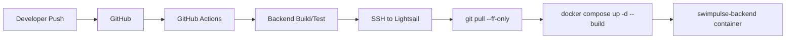
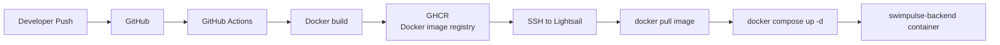
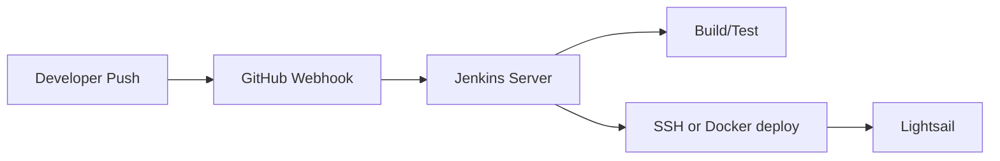

# 047 Backend CI/CD: GitHub Actions, Jenkins, Lightsail 배포 방식 비교

작성일: 2026-07-16

## 현재 상황

SwimPulse 배포 구조는 현재 다음과 같다.

```text
Frontend
  -> Vercel
  -> GitHub push 시 자동 build/deploy

Backend
  -> AWS Lightsail Ubuntu
  -> 사람이 SSH 접속
  -> git pull
  -> docker compose -f docker-compose.prod.yml up -d --build
```

프론트는 이미 Vercel이 CI/CD를 대신 해주고 있다. 백엔드는 아직 수동 배포라서, GitHub에 push한 코드가 자동으로 Lightsail 서버까지 반영되지 않는다.

목표는 백엔드도 다음 흐름으로 만드는 것이다.

```text
GitHub push
  -> GitHub Actions 실행
  -> backend build/test
  -> Lightsail 서버에 배포
  -> Docker container 재시작
```

## CI/CD를 쉽게 말하면

CI/CD는 두 단어를 합친 말이다.

| 용어 | 의미 | SwimPulse 예시 |
|---|---|---|
| CI | Continuous Integration, 코드가 깨졌는지 자동 확인 | push하면 backend test/build 실행 |
| CD | Continuous Delivery/Deployment, 서버에 자동 반영 | test/build 성공 후 Lightsail에 배포 |

즉, 지금 사람이 하던 일을 자동화하는 것이다.

```text
수동 배포:
SSH 접속 -> git pull -> docker compose up -d --build -> 로그 확인

자동 배포:
push -> GitHub Actions -> test/build -> SSH 명령 실행 -> 컨테이너 재시작
```

## 선택지 요약

| 방식 | 요약 | 추천도 |
|---|---|---|
| A. GitHub Actions SSH 배포 | Actions가 Lightsail에 SSH 접속해서 `git pull` + `docker compose up -d --build` 실행 | 초기 추천 |
| B. GitHub Actions Docker Image 배포 | Actions가 Docker image를 빌드해서 GHCR에 push, 서버는 image만 pull | 안정화 후 추천 |
| C. GitHub Actions self-hosted runner | Lightsail 서버 자체를 GitHub Actions runner로 등록 | 비추천에 가까움 |
| D. Jenkins 배포 | Jenkins 서버가 GitHub webhook을 받아 build/deploy | 회사/팀 운영용 |
| E. Webhook 배포 스크립트 | 서버에 webhook endpoint를 두고 push 이벤트마다 deploy script 실행 | 간단하지만 관리 애매 |

## A안. GitHub Actions SSH 배포

가장 이해하기 쉽고 지금 구조에 바로 붙일 수 있는 방식이다.



### 동작

GitHub Actions가 Lightsail 서버에 SSH 접속해서 사람이 하던 명령을 대신 실행한다.

서버에서 실행되는 명령 예시:

```bash
cd /home/ubuntu/SwimPulse
git pull --ff-only
docker compose -f docker-compose.prod.yml up -d --build --remove-orphans
docker image prune -f
```

### 장점

| 장점 | 설명 |
|---|---|
| 가장 단순함 | 지금 수동 배포 절차를 그대로 자동화한다. |
| repo 구조 변경이 적음 | `docker-compose.prod.yml`의 `build: ./backend` 구조를 그대로 쓴다. |
| 이해하기 쉬움 | Actions가 서버에 들어가서 명령어를 실행한다고 보면 된다. |
| 초기 배포에 적합 | GHCR, Docker Hub 같은 image registry를 당장 쓰지 않아도 된다. |

### 단점

| 단점 | 설명 |
|---|---|
| 서버에서 build함 | Java/Docker build가 Lightsail 2GB RAM을 사용한다. |
| 배포 중 서버 부하 | build 중 CPU/RAM이 튈 수 있다. |
| rollback이 약함 | 이전 image tag로 되돌리는 구조가 약하다. |
| 서버에 git repo 필요 | Lightsail 안에 코드 전체가 clone되어 있어야 한다. |

### SwimPulse 판단

현재 2GB Lightsail이라 build가 조금 부담될 수 있지만, 첫 자동화로는 이 방식이 가장 현실적이다.

다만 Java build가 느리거나 OOM이 나면 B안으로 넘어가는 것이 좋다.

## A안 예시 workflow

파일 위치:

```text
.github/workflows/backend-deploy.yml
```

예시:

```yaml
name: Backend Deploy

on:
  push:
    branches: [main]
    paths:
      - "backend/**"
      - "docker-compose.prod.yml"
      - ".github/workflows/backend-deploy.yml"

jobs:
  build:
    runs-on: ubuntu-latest
    defaults:
      run:
        working-directory: backend
    steps:
      - uses: actions/checkout@v4

      - uses: actions/setup-java@v4
        with:
          distribution: temurin
          java-version: "21"

      - name: Build backend
        run: ./gradlew bootJar

  deploy:
    needs: build
    runs-on: ubuntu-latest
    steps:
      - name: Prepare SSH
        run: |
          mkdir -p ~/.ssh
          echo "${{ secrets.LIGHTSAIL_SSH_KEY }}" > ~/.ssh/lightsail
          chmod 600 ~/.ssh/lightsail
          ssh-keyscan -H "${{ secrets.LIGHTSAIL_HOST }}" >> ~/.ssh/known_hosts

      - name: Deploy to Lightsail
        run: |
          ssh -i ~/.ssh/lightsail ${{ secrets.LIGHTSAIL_USER }}@${{ secrets.LIGHTSAIL_HOST }} << 'EOF'
            set -e
            cd /home/ubuntu/SwimPulse
            git pull --ff-only
            docker compose -f docker-compose.prod.yml up -d --build --remove-orphans
            docker image prune -f
            docker ps
          EOF
```

주의:

- 원칙적으로는 `./gradlew test`를 build gate로 두는 것이 좋다.
- 현재 전체 백엔드 테스트는 `NoticeCrawlerServiceTests` 3개가 실패 중이므로, full test를 CD gate로 걸면 배포가 막힌다.
- 배포 자동화를 먼저 붙이려면 임시로 `bootJar` 또는 변경 인접 테스트를 사용하고, 크롤러 테스트를 고친 뒤 `./gradlew test`로 올리는 것이 좋다.

## A안에 필요한 GitHub Secrets

GitHub repo:

```text
Settings
-> Secrets and variables
-> Actions
-> New repository secret
```

필요한 값:

| Secret | 예시 | 의미 |
|---|---|---|
| `LIGHTSAIL_HOST` | `api.sunjae.link` 또는 서버 public IP | SSH 접속 대상 |
| `LIGHTSAIL_USER` | `ubuntu` | SSH user |
| `LIGHTSAIL_SSH_KEY` | private key 전체 내용 | GitHub Actions가 서버에 접속할 키 |

서버에는 public key가 등록되어 있어야 한다.

```bash
mkdir -p ~/.ssh
nano ~/.ssh/authorized_keys
chmod 700 ~/.ssh
chmod 600 ~/.ssh/authorized_keys
```

## B안. Docker Image Registry 배포

조금 더 운영형에 가까운 방식이다.



### 동작

GitHub Actions에서 Docker image를 만든다.

```text
GitHub Actions
  -> docker build ./backend
  -> ghcr.io/<owner>/<repo>/backend:<commit-sha> push

Lightsail
  -> docker pull ghcr image
  -> docker compose up -d
```

### 장점

| 장점 | 설명 |
|---|---|
| 서버 CPU/RAM 절약 | Lightsail에서 Java build를 하지 않는다. |
| 배포 결과물이 명확함 | commit SHA별 image가 남는다. |
| rollback 쉬움 | 이전 image tag로 되돌릴 수 있다. |
| 운영형에 가까움 | 실제 회사 배포 구조와 더 비슷하다. |

### 단점

| 단점 | 설명 |
|---|---|
| 설정이 더 많음 | GHCR/Docker Hub login, image tag, compose 수정이 필요하다. |
| registry 이해 필요 | image 저장소 개념을 알아야 한다. |
| private image 권한 관리 | 서버에서 registry pull 권한이 필요하다. |

### SwimPulse 판단

Lightsail 2GB에서 build가 버겁거나, 포트폴리오에서 “CI가 image를 만들고 서버는 pull만 한다”를 보여주고 싶다면 B안이 좋다.

다만 지금 당장 가장 빠른 자동화는 A안이다.

## B안 compose 형태 예시

서버 build 방식:

```yaml
backend:
  build:
    context: ./backend
```

image pull 방식:

```yaml
backend:
  image: ghcr.io/<github-owner>/swimpulse-backend:${BACKEND_IMAGE_TAG:-latest}
```

운영에서는 `.env.deploy` 같은 파일에 tag를 넣을 수 있다.

```env
BACKEND_IMAGE_TAG=latest
```

## C안. GitHub Actions Self-hosted Runner

Lightsail 서버를 GitHub Actions runner로 등록하는 방식이다.

```text
GitHub Actions job이 GitHub 서버가 아니라 내 Lightsail Ubuntu 안에서 실행됨
```

### 장점

| 장점 | 설명 |
|---|---|
| SSH 설정이 단순해질 수 있음 | runner가 이미 서버 안에 있다. |
| 서버 내부 파일 접근 쉬움 | 배포 경로를 바로 만질 수 있다. |

### 단점

| 단점 | 설명 |
|---|---|
| 운영 서버에 CI 작업이 직접 뜸 | build/test가 서비스와 같은 서버 자원을 먹는다. |
| 보안 관리 부담 | runner 권한, repo 권한, secret 노출 관리가 필요하다. |
| 서버 장애와 CI 장애가 묶임 | 서버가 죽으면 CI도 죽는다. |
| 2GB Lightsail에 부담 | backend + redis + runner + build가 같이 돈다. |

### SwimPulse 판단

현재 2GB Lightsail에는 추천하지 않는다. 개인 프로젝트에서 급히 써볼 수는 있지만, 운영 서버와 CI 실행 환경을 섞는 것은 장기적으로 별로다.

## D안. Jenkins 배포

Jenkins는 직접 설치해서 운영하는 CI/CD 서버다.



### Jenkins는 뭐가 다른가

GitHub Actions는 GitHub가 제공하는 CI/CD 서비스다.

Jenkins는 내가 서버에 설치해서 운영하는 CI/CD 프로그램이다.

| 항목 | GitHub Actions | Jenkins |
|---|---|---|
| 운영 주체 | GitHub가 runner 제공 | 내가 Jenkins 서버 운영 |
| 설정 위치 | `.github/workflows/*.yml` | Jenkins UI 또는 Jenkinsfile |
| 설치 필요 | 거의 없음 | Jenkins 설치/업데이트 필요 |
| 서버 비용 | GitHub-hosted runner 사용 가능 | Jenkins 서버 비용 필요 |
| 보안 관리 | GitHub Secrets 중심 | Jenkins credential/plugin/user 관리 |
| 플러그인 | Actions marketplace | Jenkins plugin ecosystem |
| 개인 프로젝트 | 매우 적합 | 대체로 과함 |
| 회사 내부망 | 제약이 있으면 Jenkins 유리 | 유리 |
| 커스터마이징 | 충분하지만 GitHub 방식 안에서 | 매우 자유롭지만 관리 부담 큼 |

### Jenkins 장점

| 장점 | 설명 |
|---|---|
| 자유도가 높음 | 복잡한 파이프라인, 내부망, 레거시 환경에 강하다. |
| 회사에서 많이 씀 | 오래된 조직/온프레미스 환경에서 흔하다. |
| UI로 job 관리 가능 | 히스토리, 파라미터 빌드, 수동 승인 등을 만들 수 있다. |

### Jenkins 단점

| 단점 | 설명 |
|---|---|
| 직접 운영해야 함 | 설치, 업데이트, 보안 패치, 플러그인 충돌을 관리해야 한다. |
| 메모리 사용량 | 2GB Lightsail에 backend와 같이 올리기 부담스럽다. |
| 초기 설정이 번거로움 | GitHub Actions보다 시작 비용이 크다. |
| 포트폴리오에서 설명 포인트가 흐려질 수 있음 | 서비스보다 Jenkins 운영 이야기가 커질 수 있다. |

### SwimPulse 판단

SwimPulse 첫 운영 배포에는 Jenkins보다 GitHub Actions가 맞다.

Jenkins는 다음 상황에서 검토하면 된다.

```text
회사 내부망 배포
여러 프로젝트/여러 서버 통합 CI 필요
GitHub Actions 사용 제한
Jenkins 경험 자체를 포트폴리오에 넣고 싶을 때
```

## E안. Webhook 배포 스크립트

서버에 작은 webhook receiver를 띄워두고, GitHub push 이벤트를 받으면 deploy script를 실행하는 방식이다.

### 장점

| 장점 | 설명 |
|---|---|
| 단순하게 만들 수 있음 | push 이벤트 -> shell script 실행 |
| GitHub Actions minutes 사용 없음 | Actions를 거의 안 써도 된다. |

### 단점

| 단점 | 설명 |
|---|---|
| 직접 구현/보안 검증 필요 | webhook secret 검증, replay 방지 등을 챙겨야 한다. |
| 로그/실패 관리가 약함 | Actions UI처럼 보기 어렵다. |
| 운영 서버에 외부 endpoint 추가 | 공격면이 늘어난다. |

### SwimPulse 판단

학습용으로는 가능하지만 지금은 GitHub Actions SSH 배포가 더 안전하고 이해하기 쉽다.

## 추천 결정

### 지금 바로 추천

```text
A안. GitHub Actions SSH 배포
```

이유:

1. 현재 수동 배포 절차를 거의 그대로 자동화할 수 있다.
2. `docker-compose.prod.yml` 구조를 크게 바꾸지 않아도 된다.
3. Vercel처럼 push 기반 자동 배포 경험을 백엔드에도 붙일 수 있다.
4. GitHub Actions UI에서 성공/실패 로그를 볼 수 있다.

### 안정화 후 추천

```text
B안. GitHub Actions Docker Image Registry 배포
```

이유:

1. Lightsail 2GB의 build 부담을 줄일 수 있다.
2. commit SHA image tag로 rollback이 쉬워진다.
3. 실제 회사식 배포 구조와 더 가깝다.

## SwimPulse 기준 단계별 도입안

### 1단계. SSH 자동 배포

1. GitHub Actions workflow 생성
2. GitHub Secrets에 SSH 키 등록
3. push 시 backend build 확인
4. Lightsail에 SSH 접속
5. `git pull --ff-only`
6. `docker compose -f docker-compose.prod.yml up -d --build --remove-orphans`
7. `docker ps`, `/actuator/health` 확인

### 2단계. 배포 안정성 보강

1. 배포 전 `docker compose config` 확인
2. 배포 후 healthcheck 실패 시 로그 출력
3. `docker logs --tail=200 swimpulse-backend` 자동 출력
4. 배포 실패 시 기존 컨테이너 유지 전략 검토

### 3단계. Image registry 전환

1. GHCR에 backend image push
2. `docker-compose.prod.yml` 또는 별도 `docker-compose.prod.image.yml`에서 `image:` 사용
3. 서버는 `docker pull` 후 재시작
4. commit SHA tag 기준 rollback 문서화

## 실무적으로 중요한 포인트

### 1. 서버의 `.env.prod`는 GitHub에 올리지 않는다

GitHub Actions가 서버에 배포하더라도, 운영 비밀값은 서버에 남겨두는 것이 안전하다.

```text
repo에는 .env.prod.example만 존재
Lightsail에는 backend/.env.prod 존재
Docker compose는 env_file로 읽음
```

### 2. Firebase service account도 repo에 올리지 않는다

서버에만 둔다.

```text
deploy/secrets/firebase-adminsdk.json
```

workflow가 이 파일을 건드릴 필요는 없다.

### 3. `git pull --ff-only`를 쓴다

서버에서 충돌이 나면 자동 merge하지 않고 실패하게 하는 편이 안전하다.

```bash
git pull --ff-only
```

이 명령이 실패하면 서버에 로컬 변경이 있거나 branch가 꼬인 것이다.

### 4. 배포 branch를 정한다

추천:

```text
main push -> 운영 배포
feature branch push -> 테스트만 실행
```

처음에는 실수 방지를 위해 `workflow_dispatch` 수동 실행도 같이 두는 것이 좋다.

```yaml
on:
  workflow_dispatch:
  push:
    branches: [main]
```

### 5. 전체 테스트 상태를 먼저 정리하면 가장 좋다

현재 전체 백엔드 테스트에는 공지 크롤러 쪽 실패가 남아 있다.

CD gate로 `./gradlew test`를 걸고 싶다면 먼저 그 테스트를 고치는 것이 맞다.

그 전까지는 다음 중 하나를 선택한다.

| 선택 | 의미 |
|---|---|
| `./gradlew bootJar` | 컴파일/패키징만 확인 |
| 변경 인접 테스트만 실행 | 빠르지만 검증 범위 제한 |
| 실패 테스트를 임시 disable | 이유와 TODO를 명확히 남겨야 함 |
| 전체 테스트 수정 후 `./gradlew test` | 가장 좋은 최종 상태 |

## 최종 추천

SwimPulse는 지금 다음 순서가 가장 자연스럽다.

```text
1. GitHub Actions SSH 배포로 수동 배포 제거
2. 전체 테스트 실패 정리
3. CD gate를 ./gradlew test로 강화
4. Lightsail build가 부담되면 GHCR image 배포로 전환
5. 필요하면 rollback script와 healthcheck 자동화 추가
```

Jenkins는 지금 단계에서는 과하다.

포트폴리오 관점에서도 지금은 다음 문장이 더 좋다.

```text
Vercel로 frontend CI/CD를 구성하고,
GitHub Actions에서 backend build 검증 후
Lightsail Docker Compose 서버에 SSH 기반 자동 배포를 구성했다.
이후 서버 build 부담과 rollback 개선을 위해 GHCR 기반 image 배포로 확장할 수 있도록 설계했다.
```

