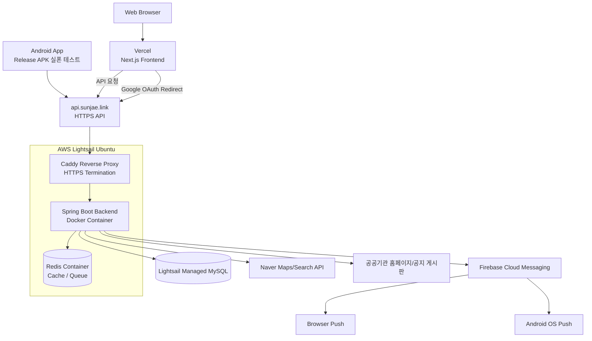

# 050 SwimPulse 포트폴리오 배포 아키텍처 수정본

작성일: 2026-07-17

## 목적

현재 포트폴리오 Notion에는 SwimPulse의 기능, 성능 개선, Redis queue, OCR worker, 알림 정합성 개선은 잘 드러나 있다.

이번 수정본은 여기에 실제 배포 상태를 추가하기 위한 문서다.

현재 실제 배포 상태:

| 영역 | 현재 상태 |
|---|---|
| Web Frontend | Vercel 배포 |
| Backend | AWS Lightsail Ubuntu 서버 |
| HTTPS / Reverse Proxy | Caddy, `api.sunjae.link` |
| Backend Runtime | Docker Compose |
| Database | Lightsail Managed MySQL |
| Redis | Lightsail 서버 내부 Docker Redis |
| CI/CD | GitHub Actions test gate 후 SSH 배포 |
| Mobile | React Native Android release APK 실폰 설치 및 운영 API/FCM 검증 |

포트폴리오에서는 “대규모 AWS 운영 아키텍처를 이미 운영했다”처럼 과장하기보다, **비용을 고려한 현실적인 배포 구조를 직접 구성했고, 이후 ECS/RDS/ElastiCache 구조로 확장 가능한 설계를 문서화했다**는 방향이 자연스럽다.

---

## Notion 수정 권장 위치

기존 Notion의 `### 🧩3. 시스템 아키텍처`를 아래 내용으로 교체하거나, 기존 내용 아래에 `배포 아키텍처`와 `CI/CD`를 추가하는 것을 추천한다.

---

## 🧩3. 시스템 및 배포 아키텍처

### 전체 구조



### 실제 배포 구성

| 영역 | 구성 |
|---|---|
| Frontend | Vercel 배포, GitHub push 기반 자동 배포 |
| Backend | AWS Lightsail Ubuntu, Docker Compose 기반 Spring Boot 배포 |
| HTTPS / Reverse Proxy | Caddy가 `api.sunjae.link` HTTPS 처리 후 내부 8080 포트로 reverse proxy |
| Database | Lightsail Managed MySQL |
| Redis | Lightsail 서버 내부 Docker Redis, cache/queue 용도 |
| Mobile | React Native Android release APK를 실폰에 설치해 운영 API 연동 검증 |
| Push | Firebase Cloud Messaging으로 Web Push와 Android Push 발송 |
| CI/CD | GitHub Actions에서 backend test 통과 후 Lightsail SSH 배포 |
| Health Check | 배포 후 `/actuator/health` 확인 및 컨테이너 상태 검증 |

### 주요 데이터 플로우

#### 웹 요청 흐름

```text
사용자 브라우저
-> Vercel Frontend
-> api.sunjae.link HTTPS API 호출
-> Caddy Reverse Proxy
-> Spring Boot Backend
-> MySQL / Redis
```

#### 모바일 요청 흐름

```text
Android App
-> Google Sign-In
-> /api/auth/mobile/google
-> Bearer JWT 저장
-> 운영 API 호출
-> FCM token 등록
-> Android OS Push 수신
```

#### 알림 발송 흐름

```text
사용자 구독
-> registration_event 생성 또는 기존 이벤트 재사용
-> EventScheduler가 due event 감지
-> notification row 생성
-> DB commit 이후 Redis queue publish
-> NotificationWorker가 Redis에서 notificationId pop
-> 사용자 활성 device token 전체로 FCM 발송
-> Web Push / Android Push 수신
```

---

## 🚀배포 및 운영 자동화

### CI/CD 흐름

```mermaid
flowchart LR
  Dev[Developer Push] --> GitHub[GitHub Repository]

  GitHub -->|frontend 변경| VercelDeploy[Vercel Auto Deploy]
  VercelDeploy --> WebProd[Production Web]

  GitHub -->|backend 변경| Actions[GitHub Actions]
  Actions --> Test[./gradlew test]
  Test -->|성공| SSH[SSH to Lightsail]
  SSH --> Pull[git pull --ff-only]
  Pull --> Compose[docker compose up -d --build]
  Compose --> Health[/actuator/health 재시도 확인]
  Health --> ApiProd[Production Backend]
```

### 구현 내용

- 프론트엔드는 Vercel에 연결해 GitHub push만으로 자동 배포되도록 구성했다.
- 백엔드는 초기에는 Lightsail 서버에 직접 접속해 `git pull`, `docker compose up -d --build`를 실행했다.
- 이후 GitHub Actions SSH 배포 workflow를 추가해 수동 배포 과정을 자동화했다.
- 배포 전 `./gradlew test`를 CI gate로 두어, 백엔드 전체 테스트가 통과한 경우에만 운영 서버에 반영되도록 구성했다.
- 배포 후에는 `/actuator/health`를 최대 180초 동안 재시도 확인하고, 실패 시 최근 Docker 로그를 출력하도록 했다.
- 단순히 컨테이너 실행 성공만 보는 것이 아니라, Spring Boot 애플리케이션 기동 완료까지 확인하도록 구성했다.

### GitHub Actions 배포 흐름

```text
GitHub push
  -> GitHub Actions
  -> backend 전체 테스트
  -> Lightsail SSH 접속
  -> git pull --ff-only
  -> docker compose up -d --build --remove-orphans
  -> Docker image prune
  -> /actuator/health 확인
  -> 배포 완료
```

---

## 📱모바일 운영 API 및 FCM 검증

React Native Android 앱은 아직 Play Store 배포 전 단계이지만, release APK를 직접 빌드해 실제 Android 기기에 설치하고 운영 API와 FCM Push를 검증했다.

```text
React Native Android release APK
-> 실폰 설치
-> https://api.sunjae.link 운영 API 호출
-> Google 로그인
-> Bearer JWT 저장
-> FCM token 등록
-> Web에서 테스트 알림 발송
-> Android OS 알림 수신 확인
```

### 모바일 인증/푸시 구조

| 항목 | 구현 |
|---|---|
| 로그인 | Google Sign-In |
| 모바일 인증 | `/api/auth/mobile/google`에서 idToken 검증 후 SwimPulse JWT 발급 |
| 토큰 저장 | 모바일 secure storage |
| API 인증 | `Authorization: Bearer <JWT>` |
| Push token | Android FCM token을 `user_devices`에 `platform=ANDROID`로 등록 |
| 발송 | 사용자 활성 Web/Android device token 전체로 FCM 발송 |

---

## 🧱8. 기술 스택 수정안

기존 기술 스택에서 `Infra`와 `Mobile` 항목을 아래처럼 수정하는 것을 추천한다.

### BackEnd

- Java 21, Spring Boot, Spring Data JPA

### FrontEnd

- Next.js, React, TypeScript, Tailwind CSS

### Mobile

- React Native, TypeScript
- Android Studio, Gradle, ADB
- Firebase Messaging, Google Sign-In

### Database

- MySQL, Lightsail Managed MySQL

### Auth

- Google OAuth2
- Web: JWT HttpOnly Cookie, SameSite=None, Secure
- Mobile: Bearer JWT, Secure Storage

### Queue / Cache

- Redis List, Redis TTL Cache, Single-flight Lock

### Notification

- Firebase Cloud Messaging
- Web Push, Service Worker
- Android Push

### Crawling / OCR

- Jsoup, Tesseract OCR

### Observability

- Spring Actuator, Micrometer
- Prometheus, Grafana

### Load Test

- k6

### Infra / Deployment

- Vercel
- AWS Lightsail
- Docker, Docker Compose
- Caddy
- GitHub Actions, SSH Deploy

---

## 프로젝트 성과 요약에 추가할 문장

기존 성과 요약 아래에 아래 문장을 추가하면 좋다.

```text
- Vercel, AWS Lightsail, Caddy, Docker Compose, Lightsail Managed MySQL을 활용해 웹/백엔드/DB를 실제 HTTPS 운영 환경으로 배포
- GitHub Actions 기반 백엔드 CI/CD를 구성해 ./gradlew test 통과 후 Lightsail 서버에 자동 배포되도록 개선
- React Native Android release APK를 실폰에 설치하고, 운영 API 및 FCM Android Push 수신까지 검증
- 웹 브라우저 푸시와 Android 앱 푸시를 동일한 FCM/device token 구조로 통합하여 사용자별 다중 기기 알림 발송 구조 구현
```

---

## 운영 관점에서 추가할 수 있는 배운 점

기존 `성능/운영 관점에서 고민한 점 및 배운점` 섹션에는 아래 내용을 추가할 수 있다.

```text
- 개인 프로젝트 수준에서는 ECS/Fargate, RDS, ElastiCache를 모두 상시 운영하면 비용 부담이 크기 때문에, 초기 배포는 Vercel + Lightsail + Managed MySQL 구조로 비용과 운영 복잡도를 낮췄다.
- Spring Boot 백엔드는 scheduler, OCR worker, notification worker처럼 장시간 실행되는 작업이 있어 serverless frontend 플랫폼보다 VPS/Docker Compose 기반 배포가 적합하다고 판단했다.
- 백엔드 배포는 단순 SSH 수동 명령에서 GitHub Actions 기반 CI/CD로 전환했고, 전체 테스트 통과와 healthcheck를 배포 gate로 두었다.
- 모바일 앱은 서버에 배포되는 것이 아니라 설치된 앱이 운영 API와 FCM에 연결되는 구조임을 이해하고, Android release APK 실폰 테스트로 운영 API/Push 흐름을 검증했다.
```

---

## 포트폴리오 표현 시 주의할 점

현재 상태를 정확히 표현하면 다음이 좋다.

| 표현 | 권장 여부 | 이유 |
|---|---|---|
| AWS Lightsail에 백엔드 운영 배포 | 권장 | 실제 상태와 일치 |
| Vercel + Lightsail 기반 저비용 운영 아키텍처 구성 | 권장 | 설계 의도가 드러남 |
| GitHub Actions로 백엔드 CI/CD 구성 | 권장 | 실제 구현 상태 |
| 모바일 앱 Play Store 배포 완료 | 비권장 | 현재는 실폰 APK 테스트 단계 |
| ECS/Fargate 운영 경험 | 비권장 | 현재 실제 운영 구조는 Lightsail |
| ECS/RDS/ElastiCache 확장 아키텍처 설계 | 조건부 권장 | “목표 구조/개선안”으로 표현하면 자연스러움 |

추천 문장:

```text
초기 운영 비용을 고려해 프론트엔드는 Vercel, 백엔드는 AWS Lightsail Docker Compose, DB는 Lightsail Managed MySQL로 배포했습니다. 이후 트래픽 증가 시 API/worker 분리, RDS/ElastiCache 이전, ECS/Fargate 전환이 가능하도록 확장 아키텍처를 별도로 설계했습니다.
```

---

## 최종 판단

현재 포트폴리오에서 가장 보강하면 좋은 지점은 “실제 서비스 배포/운영 흐름”이다.

기존 문서의 강점:

- Redis queue와 DB 상태 기반 알림 정합성
- OCR 비동기 처리
- 외부 API 캐시와 single-flight
- 부하 테스트 기반 성능 개선

추가하면 좋은 강점:

- Vercel + Lightsail + Managed MySQL 실제 배포
- Caddy HTTPS reverse proxy 구성
- GitHub Actions 기반 백엔드 CI/CD
- Android 실폰 앱 + 운영 API + FCM Push 검증

이렇게 정리하면 SwimPulse는 단순 기능 구현 프로젝트가 아니라, **비정형 공공기관 데이터 수집, queue 기반 비동기 처리, FCM 알림, 성능 개선, 실제 배포와 모바일 연동까지 경험한 서비스형 프로젝트**로 보인다.
