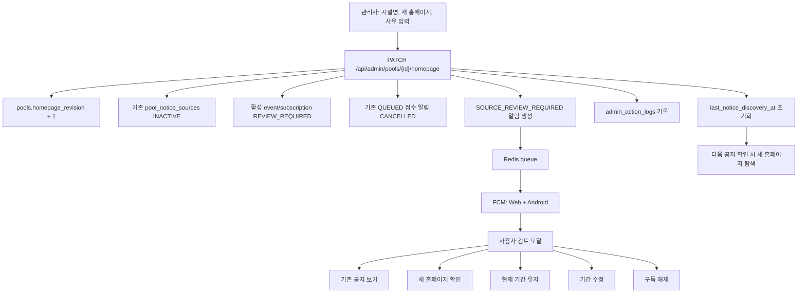

# 054 수영장 홈페이지 교정 및 구독 검토 흐름 구현 보고서

작성일: 2026-07-18

## 목적

수영장에 잘못된 기관 홈페이지가 연결된 경우 기존 공지와 모집 기간을 강제로 삭제하지 않으면서 다음 문제를 함께 해결한다.

1. 잘못된 이전 홈페이지의 공지가 최신 결과처럼 다시 노출되는 문제
2. 잘못된 출처에서 만들어진 구독 알림이 그대로 발송되는 문제
3. 운영 DB를 SQL로 직접 수정하고 관련 row를 수동 삭제해야 하는 문제
4. 홈페이지 변경 사실과 영향 범위를 사용자 및 운영자가 알 수 없는 문제

## 최종 동작



## DB 변경

Flyway migration:

```text
V18__add_homepage_revision_and_subscription_review.sql
```

| 테이블 | 추가/변경 | 목적 |
|---|---|---|
| `pools` | `homepage_revision` | 홈페이지 교정 세대 관리 |
| `pool_notice_sources` | `homepage_revision` | 어떤 홈페이지 세대에서 찾은 경로인지 구분 |
| `pool_notices` | `homepage_revision` | 이전 출처 공지 fallback 차단 |
| `registration_events` | `source_validity_status`, 변경 시각·사유 | 이벤트 출처 검토 상태 추적 |
| `subscriptions` | `review_status`, 요청·완료 시각·사유 | 사용자별 검토 상태 추적 |
| `notifications` | `subscription_id` | 알림에서 대상 구독으로 직접 이동 |
| `notifications.type` | `SOURCE_REVIEW_REQUIRED` | 홈페이지 교정 안내 알림 |
| `notifications.status` | `CANCELLED` | 삭제하지 않고 발송 취소 이력 보존 |

기존 데이터는 revision `1`, 상태 `ACTIVE`로 시작한다. 기존 알림은 같은 사용자와 이벤트의 구독을 기준으로 `subscription_id`를 backfill한다.

## 관리자 교정 흐름

관리자 페이지 상단에 `수영장 홈페이지 교정` 도구를 추가했다.

입력 항목:

- 대상 수영장
- 올바른 시설명
- 새 홈페이지 전체 URL
- 사용자에게 표시할 교정 사유

실행 순서:

1. 관리자 확인 모달 표시
2. 시설명 또는 홈페이지가 실제로 변경됐는지 검증
3. 기존 공지 source를 `INACTIVE`로 전환
4. pool의 homepage revision 증가
5. 아직 모집이 끝나지 않은 구독과 이벤트만 `REVIEW_REQUIRED`로 전환
6. 해당 구독의 `QUEUED` 리마인더·접수 시작 알림을 `CANCELLED`로 전환
7. 구독별 `SOURCE_REVIEW_REQUIRED` 알림 생성
8. `CORRECT_POOL_HOMEPAGE` 관리자 작업 로그 기록
9. `last_notice_discovery_at`을 `NULL`로 초기화해 다음 공지 확인에서 새 홈페이지 경로를 탐색하도록 준비

홈페이지 교정 직후 자동으로 공지 확인을 호출하지 않는다. 자동 호출은 탐색 시작 시각을 즉시 다시 기록해,
새 홈페이지 기준 첫 공지 확인이 24시간 discovery interval에 막힐 수 있기 때문이다.
사용자 또는 관리자가 다음에 `공지 확인`을 누르면 새 홈페이지를 기준으로 탐색하고 그 시점에 discovery 시각을 기록한다.

## 이전 공지 fallback 차단

기존에는 최신 크롤링이 실패하면 해당 수영장의 최근 `pool_notices`를 revision 구분 없이 반환할 수 있었다.

변경 후 조회 기준:

```text
pool_id = 현재 수영장
AND homepage_revision = pools.homepage_revision
ORDER BY id DESC
LIMIT 20
```

따라서 홈페이지 revision이 `1 -> 2`로 증가한 뒤 revision `1`에서 수집한 다른 기관 공지는 최신 fallback 결과로 다시 나오지 않는다.

## 알림 및 구독 상태

### 교정 직후

```text
Subscription: REVIEW_REQUIRED
RegistrationEvent: REVIEW_REQUIRED
기존 미발송 접수 알림: CANCELLED
교정 안내 알림: QUEUED -> SENDING -> SENT/FAILED
```

`CANCELLED`를 사용하므로 기존 알림을 삭제하지 않고 운영 이력을 유지할 수 있다. 스케줄러도 `REVIEW_REQUIRED` 구독에는 새 접수 알림을 만들지 않는다.

### 사용자가 현재 기간 유지

```text
POST /api/subscriptions/{subscriptionId}/source-review/confirm
Subscription: CONFIRMED
```

취소된 알림은 현재 시각에도 의미가 있을 때만 재개한다.

- 리마인더: 접수 시작 전일 때만 재개
- 접수 시작: 접수 진행 중일 때만 재개
- 이미 지난 알림: 재개하지 않음

### 사용자가 기간 수정

기존 구독 row는 유지하고 사용자 구독만 새 `registration_event`로 재연결한다. 상태는 `CONFIRMED`가 되며 새 기간 기준으로 scheduler가 동작한다.

### 사용자가 구독 해제

기존 구독 해제 API를 사용한다. `notifications.subscription_id`는 FK `ON DELETE SET NULL`이므로 과거 알림 이력은 남는다.

## 사용자 UX

### 웹

- 웹 푸시 알림에서 `SOURCE_REVIEW_REQUIRED`를 구분한다.
- 서비스 워커가 `/my-page?subscriptionId={id}`로 이동한다.
- 마이페이지에서 해당 구독 상세 모달을 자동으로 연다.
- 알림 목록에서 교정 알림을 눌러도 같은 구독 모달을 연다.
- 알림을 놓친 뒤에도 찾을 수 있도록 `내 구독` 목록에서 `REVIEW_REQUIRED` 구독을 최상단에 정렬한다.
- 마이페이지 상단과 각 대상 카드에 아래 안내를 표시하고, 카드 안의 `검토하기`로 상세 모달을 바로 연다.

```text
홈페이지 출처 변경으로 구독 검토가 필요합니다.
잘못 연결된 홈페이지 출처를 올바른 시설 홈페이지로 교정했습니다.
```

- 검토 모달에 다음 액션을 제공한다.

```text
기존 공지 보기 -> registration_events.notice_url
새 홈페이지 확인 -> pools.homepage_url
현재 기간 유지
기간 수정
구독 해제
```

### Android 앱

- FCM data payload에 `subscriptionId`, `currentHomepageUrl`, `type`을 포함한다.
- foreground, background 알림 클릭, 앱 종료 상태 initial notification 모두 같은 알림 상세 흐름을 사용한다.
- `구독 검토하기`를 누르면 마이페이지로 이동해 대상 구독 상세 모달을 자동으로 연다.
- 앱 알림 목록에서도 교정 알림 클릭 시 일반 알림 모달 대신 구독 검토 모달을 연다.
- 진행 중인 구독에서 검토 대상을 상단에 정렬하고, 카드에 검토 사유와 `검토하기` 버튼을 표시한다.

## API

```text
PATCH /api/admin/pools/{poolId}/homepage
POST  /api/subscriptions/{subscriptionId}/source-review/confirm
```

관리자 교정 API는 `/api/admin/**`에 포함되므로 `ROLE_ADMIN`만 호출할 수 있다. 확인 API는 로그인 사용자 소유의 구독만 처리한다.

## 주요 응답 필드

`PoolResponse`:

```text
homepageRevision
```

`SubscriptionResponse`:

```text
reviewStatus
reviewRequestedAt
reviewedAt
reviewReason
```

`NotificationResponse`:

```text
subscriptionId
subscriptionReviewStatus
noticeUrl
currentHomepageUrl
```

## 테스트 결과

### 백엔드

```text
./gradlew.bat test
74 tests, 20 suites
failures 0, errors 0, skipped 0
BUILD SUCCESSFUL
```

추가한 핵심 테스트:

- 관리자 교정 시 revision/source/event/subscription 상태 전이
- 활성 구독 영향 건수와 알림 취소 요청
- 현재 기간 유지 시 구독 `CONFIRMED` 및 알림 재개
- `QUEUED -> CANCELLED` 이력 보존
- revision 기반 교정 안내 알림 dedupe key와 subscription 연결
- 교정 직후 `last_notice_discovery_at`이 `NULL`로 유지되는지 확인

### 웹

```text
npm run lint
npm run build
```

두 명령 모두 성공했다. Next.js production build와 TypeScript 검사를 통과했다.

### 후속 수정: 공지 기간 구독 버튼 상태

홈페이지 교정 뒤 동일한 `notice_registration_period_id`가 연결된 이벤트를 재사용하는 경우,
공지 제목 또는 기간 label이 바뀌면 웹의 기존 `제목 + 시작/종료 시각` 비교가 구독 상태를 놓칠 수 있었다.
이 경우 서버는 기존 구독을 반환해 마이페이지에는 구독이 보이지만, 공지 모달 버튼은 계속 `이 기간 구독`으로 보였다.

`PeriodSelectionRow`는 이제 실제 공지 기간의 안정적인 식별자인 `noticeRegistrationPeriodId`를 먼저 비교한다.
과거 공지를 현재 달 예상 기간으로 보정해 만든 수동 이벤트에는 ID가 없으므로 기존 제목·시각 비교를 fallback으로 유지했다.

```text
npm run lint  -> 성공
npm run build -> 성공
```

검토 대상 구독 카드 노출과 정렬 변경 후에도 `npm run lint`, `npm run build`를 다시 통과했다.

### 후속 수정: 브라우저 OS 알림 클릭 이동

교정 알림을 클릭하면 서비스 워커가 `/my-page?subscriptionId={id}`로 이동시키고,
마이페이지가 해당 구독 상세 모달을 자동으로 열어야 한다.

- 모든 웹 페이지 진입 시 `firebase-messaging-sw.js` 등록과 update 확인을 수행하도록 했다. 따라서 관리자 페이지에 머무르던 경우에도 새 서비스 워커를 받는다.
- 클릭 대상은 절대 URL로 만들고, 기존 브라우저 탭 이동이 실패하면 대상 URL을 새 창으로 연다.
- 이미 표시된 OS 알림은 생성 당시 저장된 service worker data를 계속 사용한다. 새 코드 배포 전 수신한 알림은 소급 수정되지 않으므로, 배포 후 새 교정 알림으로 검증해야 한다.

### 모바일

```text
npm run lint
npx tsc --noEmit
npm test -- --runInBand
```

모두 성공했고 Jest `1 suite / 1 test`가 통과했다.

검토 대상 카드 노출과 정렬 변경 후에도 `npm run lint`, `npx tsc --noEmit`, `npm test -- --runInBand`를 다시 통과했다.

이번 검증에는 실기기 APK 재설치와 실제 운영 FCM 수신 수용 테스트는 포함하지 않았다. 변경 코드를 실폰에서 확인하려면 049 보고서의 짧은 경로 복사, release APK 재빌드, `adb install -r` 순서를 사용한다.

## 배포 순서

1. 변경사항을 `main`에 push
2. GitHub Actions 백엔드 전체 테스트 통과 확인
3. Lightsail 배포 시 Flyway V18 자동 적용 확인
4. `docker logs --tail=200 -f swimpulse-backend`에서 migration/JPA validate 확인
5. Vercel 프론트 자동 배포 확인
6. 관리자 페이지에서 테스트 수영장 1건 교정
7. `admin_action_logs`, subscription 상태, notification 상태 확인
8. 웹 푸시와 Android 앱에서 검토 알림 수신 확인

운영 DB에 V18을 수동으로 먼저 적용하지 않는다. 현재 배포 설정처럼 Flyway가 schema migration을 담당하게 한다.

## 최종 판단

기존 row를 강제 삭제하거나 운영 SQL을 반복하는 방식 대신 revision과 명시적 상태 전이를 사용했다. 이 방식은 과거 이력을 보존하면서 잘못된 출처의 재노출과 오발송을 막고, 사용자에게 최종 구독 판단권을 돌려준다.

현재 규모에서는 이 설계가 데이터 보존, 운영 편의성, 구현 복잡도 사이에서 적절하다. 향후 교정 요청이 많아지면 관리자 교정 이력을 별도 `pool_homepage_revisions` 테이블로 분리해 이전·현재 홈페이지와 재검증 결과를 구조적으로 조회하는 방향을 고려할 수 있다.
