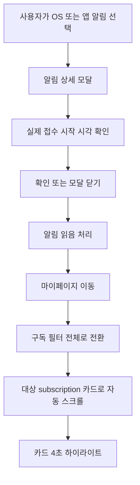

# 061 알림 대상 구독 이동 및 하이라이트 개선

작성일: 2026-07-20

## 목적

접수 예정 및 접수 시작 알림을 눌렀을 때 알림 상세 모달만 닫히고 끝나던 흐름을 개선했다. 사용자가 알림과 연결된 실제 구독을 바로 찾을 수 있도록 웹과 모바일 모두 마이페이지의 대상 구독으로 이동하고 자동 스크롤·하이라이트를 제공한다.

모바일 기간 수정 화면에 있던 임의의 시간 프리셋도 함께 제거했다.

## 1. 모바일 기간 수정 프리셋 제거

제거한 버튼:

```text
오전 9시
오전 10시
정오
오후 6시
오후 11시
마감 23:59
```

이 값들이 서비스에서 반복적으로 사용된다는 근거가 없고, 네이티브 날짜·시간 선택기가 이미 있으므로 중복 UI였다. 잘못 누르면 사용자가 선택한 값을 덮어쓸 수도 있어 제거했다.

현재 기간 수정은 다음 흐름만 제공한다.

```text
날짜 버튼 -> Android 달력
시간 버튼 -> Android 시계
화면 표시 -> Asia/Seoul
서버 전송 -> UTC ISO-8601 Instant
```

## 2. 일반 접수 알림 흐름

대상 알림:

- `REGISTRATION_REMINDER`: 접수 시작 전 예정 알림
- `REGISTRATION_OPEN`: 접수 시작 알림

변경 흐름:



`확인`, 모달 바깥 영역, 모바일 Android 뒤로가기 중 어떤 방식으로 닫아도 `subscriptionId`가 있으면 동일한 후처리를 실행한다. 알림에 `subscriptionId`가 없으면 읽음 처리 후 현재 화면에 남는다.

## 3. 웹 구현

대시보드 알림 모달의 모든 닫기 동작을 대상 구독 이동으로 통합했다.

일반 알림 이동 주소:

```text
/my-page?subscriptionId={subscriptionId}
```

마이페이지는 다음 순서로 대상 카드를 표시한다.

1. 전체 구독 데이터에서 `subscriptionId` 검색
2. `전체` 필터로 전환해 예정·시작·종료 상태와 관계없이 카드 표시
3. `scrollIntoView({ behavior: "smooth", block: "center" })` 실행
4. 대상 카드에 파란 배경, 테두리, ring, shadow 적용
5. 4초 뒤 강조 스타일 해제

홈페이지 출처 변경 알림은 기존 검토 흐름을 유지한다.

```text
/my-page?subscriptionId={subscriptionId}&openDetail=1
```

이 경우 카드 스크롤·하이라이트와 함께 구독 상세 검토 모달도 열린다.

마이페이지 알림 목록에서 일반 알림 모달을 연 경우에도 확인 또는 바깥 영역 클릭으로 같은 스크롤·하이라이트를 실행한다.

## 4. 모바일 구현

React Navigation의 마이페이지 파라미터를 확장했다.

```text
subscriptionId: 대상 구독 ID
openDetail: 출처 검토 상세 모달 자동 표시 여부
focusRequestId: 같은 구독 알림을 반복해서 열어도 다시 포커스하기 위한 요청 식별값
```

마이페이지 `ScrollView`와 구독 카드의 `onLayout` 값을 사용해 다음 위치를 계산한다.

```text
내 구독 섹션 Y 위치
+ 대상 구독 카드 Y 위치
- 상단 여백
= 최종 scrollTo 위치
```

카드 레이아웃이 아직 완료되지 않았으면 대상 ID를 pending 상태로 보관하고, 해당 카드의 `onLayout`이 발생한 직후 스크롤한다. 따라서 다른 상태 필터가 선택돼 대상 카드가 잠시 렌더링되지 않았던 경우에도 `전체` 전환 후 정상적으로 찾는다.

강조된 카드는 파란 배경·테두리·그림자로 구분하고 4초 뒤 원래 스타일로 복귀한다.

## 5. UX 판단

사용자가 알림 내용을 읽은 뒤 모달을 닫는 모든 행동을 동일하게 취급한다. 특정 버튼을 찾아 눌러야만 대상 구독을 볼 수 있게 하면 바깥 영역을 눌렀을 때 중요한 후속 안내를 놓칠 수 있기 때문이다.

```text
확인 버튼
모달 바깥 영역
Android 뒤로가기
-> 읽음 처리
-> 마이페이지 이동
-> 대상 구독 스크롤 및 하이라이트
```

`원문 보기`, `기존 공지 보기`, `새 홈페이지 확인`은 외부 페이지를 확인하는 별도 행동이므로 모달을 즉시 닫지 않는다. 이후 모달을 닫으면 동일한 구독 포커스가 실행된다.

## 6. 테스트 결과

### Web

| 검증 | 결과 |
|---|---|
| `npm run lint` | 통과 |
| `npm run build` | 통과 |
| Next.js TypeScript 검사 | 빌드 과정에서 통과 |
| `/my-page` 동적 route 생성 | 통과 |

### Mobile

| 검증 | 결과 |
|---|---|
| `npx tsc --noEmit` | 통과 |
| `npm run lint` | 통과 |
| `npm test -- --runInBand` | 2 suites, 4 tests 전체 통과 |

## 7. 수동 확인 항목

웹:

1. 예정 또는 시작 웹 푸시 선택
2. 알림 상세에서 실제 접수 시작 시각 확인
3. `확인` 또는 모달 바깥 영역 선택
4. 마이페이지 대상 카드 중앙 스크롤 및 4초 강조 확인

모바일:

1. 예정 또는 시작 FCM OS 알림 선택
2. 앱 알림 상세에서 `확인`, 바깥 영역 또는 Android 뒤로가기
3. 마이페이지 이동 확인
4. 전체 필터 전환, 대상 카드 스크롤 및 강조 확인

이번 변경은 모바일 JavaScript/TypeScript 코드 변경이므로 Debug 앱과 Metro가 연결된 개발 환경에서는 Fast Refresh 또는 Reload로 확인할 수 있다. Release APK에서 확인하려면 APK를 다시 빌드·설치해야 한다.
