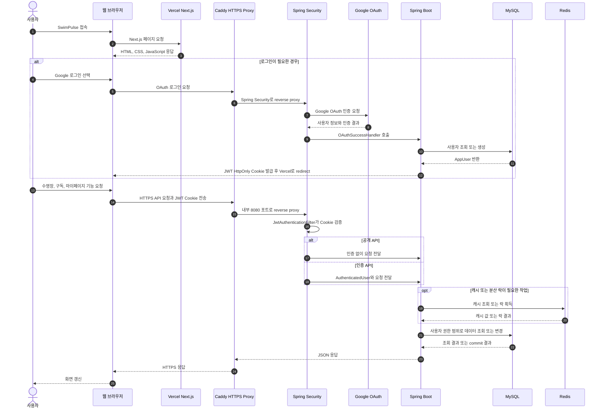
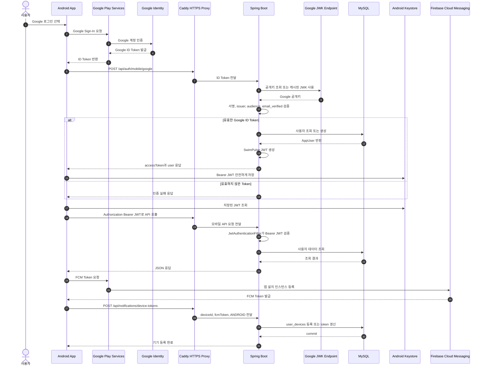
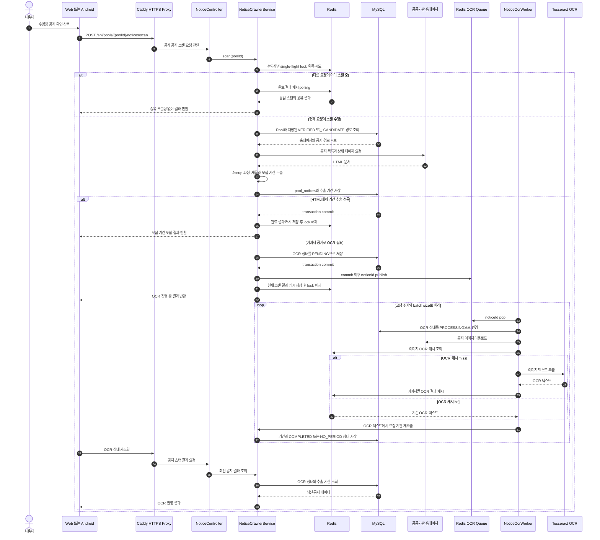
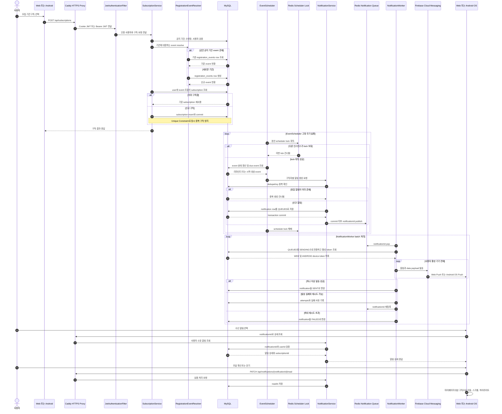
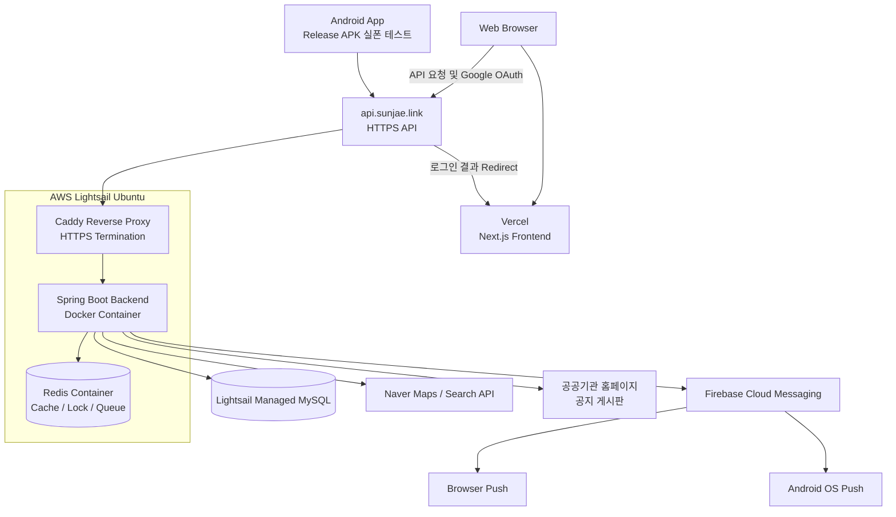
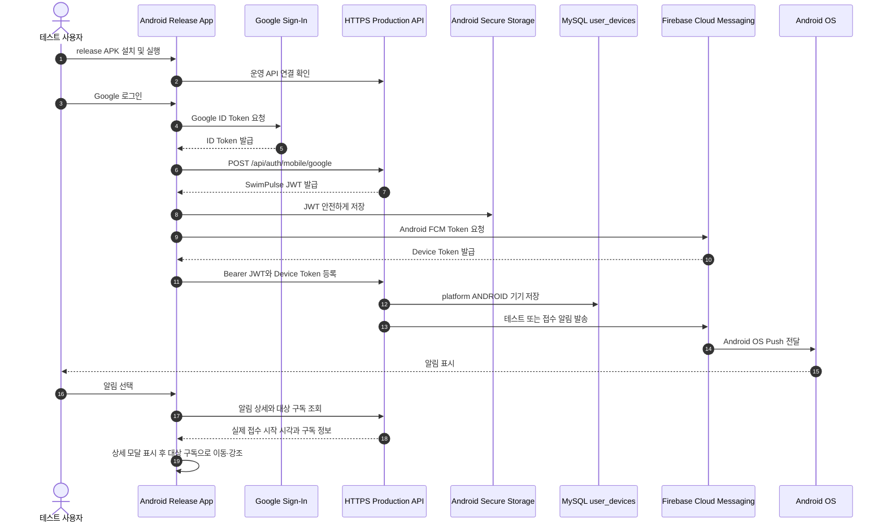

# 062 SwimPulse 사용자 데이터 흐름 시퀀스 다이어그램

작성일: 2026-07-22

## 목적

기존 포트폴리오의 단순 흐름도를 실제 요청 순서와 동기·비동기 경계가 보이는 시퀀스 다이어그램으로 개선한다.

다음 네 가지 사용자 흐름을 다룬다.

1. 웹 로그인 및 인증 API 요청
2. 모바일 Google 로그인, Bearer JWT, FCM 기기 등록
3. 공지 탐색, HTML 파싱, 백그라운드 OCR
4. 기간 구독, 알림 생성, Redis Queue, FCM 발송

---

## 1. 웹 로그인 및 인증 API 요청



### 핵심 설명

- Vercel은 Next.js 웹 화면을 제공한다.
- 브라우저의 API 요청은 `https://api.sunjae.link`의 Caddy를 거쳐 Spring Boot로 전달된다.
- 웹 인증은 `Secure`, `HttpOnly`, `SameSite=None` JWT Cookie를 사용한다.
- Spring Security가 공개 API와 인증 API를 구분하고, 인증된 요청에는 `AuthenticatedUser`를 전달한다.
- Redis는 모든 요청에 필수로 접근하는 저장소가 아니라 캐시, single-flight lock, queue가 필요한 흐름에서 사용한다.

---

## 2. 모바일 로그인, Bearer JWT, FCM 기기 등록



### 핵심 설명

- Android OAuth Client는 앱의 package name과 SHA-1을 Google에 증명한다.
- 앱은 서버가 검증할 Google ID Token을 받기 위해 Web Client ID를 사용한다.
- 백엔드는 Google ID Token을 그대로 서비스 인증 토큰으로 사용하지 않고, 검증 후 자체 SwimPulse JWT를 새로 발급한다.
- 이후 모바일 API는 Cookie가 아니라 `Authorization: Bearer <JWT>`로 인증한다.
- JWT는 React Native Keychain을 통해 Android Keystore 영역에 저장한다.
- FCM Token은 로그인 JWT와 다른 값이며, 푸시를 받을 앱 설치 인스턴스를 식별하기 위해 `user_devices`에 저장한다.

---

## 3. 공지 확인과 백그라운드 OCR



### 핵심 설명

- 같은 수영장의 동시 스캔은 Redis single-flight lock으로 하나만 실행한다.
- 다른 요청은 같은 사이트를 다시 크롤링하지 않고 첫 요청의 완료 결과를 공유한다.
- HTML에서 바로 찾은 기간은 동기 응답에 포함한다.
- 무거운 Tesseract OCR은 사용자 요청 스레드에서 분리하고, `PoolNotice`가 commit된 뒤 `noticeId`만 Redis Queue에 넣는다.
- DB commit 이후 publish하므로 Worker가 아직 저장되지 않은 공지를 읽는 문제를 방지한다.
- 클라이언트는 OCR이 `PENDING` 또는 `PROCESSING`이면 재조회해 완료 결과를 받는다.

---

## 4. 기간 구독과 FCM 알림 발송



### 핵심 설명

- 하나의 공식 모집 기간은 여러 사용자가 같은 `registration_events` row를 재사용한다.
- 사용자가 기간을 직접 수정하면 해당 구독만 새 event로 재연결되며 다른 사용자의 구독은 바뀌지 않는다.
- 구독과 알림에는 Unique Constraint 및 dedupe key를 적용해 동시 요청과 Scheduler 반복 실행의 중복 생성을 방지한다.
- 알림 row가 데이터의 source of truth이고 Redis에는 commit 이후 `notificationId`만 전달한다.
- Worker는 사용자에게 활성화된 WEB과 ANDROID token 전체로 fan-out한다.
- Worker 장애로 `SENDING`에 오래 머문 알림은 stale requeue 대상이 되어 다시 처리된다.
- 사용자가 알림 모달을 확인하거나 닫으면 읽음 처리 후 해당 구독 카드로 이동해 다시 강조한다.

---

## 포트폴리오에 배치하는 방법

기존 네 개의 `flowchart`를 위 시퀀스 다이어그램으로 교체하되, 본문이 너무 길어지면 다음 순서로 배치하는 것을 권장한다.

| 우선순위 | 다이어그램 | 보여주는 역량 |
|---|---|---|
| 1 | 공지 확인과 백그라운드 OCR | 크롤링, single-flight, 비동기 Worker, commit 이후 queue publish |
| 2 | 기간 구독과 FCM 알림 발송 | 데이터 정합성, Scheduler, dedupe, Redis Queue, 다중 기기 fan-out |
| 3 | 모바일 로그인과 기기 등록 | Google ID Token 검증, 자체 JWT, Bearer 인증, FCM token 관리 |
| 4 | 웹 로그인 및 API 요청 | Vercel, Caddy HTTPS, Cookie JWT, Spring Security |

포트폴리오 본문에는 1번과 2번을 크게 배치하고, 웹·모바일 인증 흐름은 접을 수 있는 상세 영역에 두면 핵심 백엔드 경험이 먼저 보인다.

## 요약

이 시퀀스 다이어그램은 단순히 어떤 기술을 사용했는지가 아니라 다음 설계 판단을 보여준다.

```text
웹 Cookie JWT와 모바일 Bearer JWT 분리
Google Token 검증 후 자체 서비스 JWT 발급
동일 공지 스캔의 single-flight 처리
HTML 파싱과 무거운 OCR의 실행 경계 분리
DB commit 이후 Redis Queue publish
notification row를 source of truth로 유지
dedupe key와 Unique Constraint로 중복 생성 방지
활성 WEB 및 ANDROID 기기 전체로 FCM fan-out
stale SENDING 복구와 재시도 상태 관리
```

---

## 포트폴리오 수정안: 배포·운영 자동화 및 주요 기능

아래 내용은 기존 포트폴리오의 `3. 배포 및 운영 자동화`, `모바일 운영 API 및 FCM 검증`, `4. 주요 기능`을 교체할 수 있도록 정리한 수정안이다.

### 🚀 3. 배포 및 운영 자동화

#### 운영 구성

서비스 특성과 개인 프로젝트의 운영 비용을 함께 고려해 프론트엔드는 Vercel, 백엔드와 Redis는 AWS Lightsail, 데이터베이스는 Lightsail Managed MySQL로 분리했다. Caddy가 API 도메인의 TLS 인증서 발급·갱신과 reverse proxy를 담당하며, React Native 앱도 같은 HTTPS API를 사용한다.

| 영역 | 운영 구성 | 선택 이유 |
|---|---|---|
| Web | Vercel, Next.js | GitHub 연동 배포와 HTTPS 제공 |
| API | AWS Lightsail, Docker Compose, Spring Boot | Scheduler, Worker, OCR처럼 상시 실행이 필요한 작업 운영 |
| HTTPS | Caddy, `api.sunjae.link` | TLS 자동 갱신 및 Spring Boot reverse proxy |
| Database | Lightsail Managed MySQL | 애플리케이션 서버와 DB 장애 영역 및 백업 책임 분리 |
| Queue/Cache | Lightsail 내부 Docker Redis | 초기 비용을 낮추면서 cache, lock, queue 처리 |
| Push | Firebase Cloud Messaging | Web과 Android 활성 기기로 알림 fan-out |
| Mobile | React Native Android release APK | 실기기에서 운영 API, 인증, FCM 수신 검증 |

#### CI/CD 구현과 배포 방어선

- 프론트엔드는 Vercel Git 연동으로 변경 사항을 자동 배포한다.
- 백엔드는 수동 SSH 배포에서 GitHub Actions 기반 배포로 전환했다.
- `main` 브랜치의 `backend/**`, `docker-compose.prod.yml`, workflow 변경에만 백엔드 pipeline이 실행되도록 path filter를 적용했다. 프론트 변경만 있는 push에서는 불필요한 백엔드 재빌드가 발생하지 않는다.
- GitHub-hosted Ubuntu runner에서 Java 21 환경을 만들고 `./gradlew test` 전체 통과를 CD gate로 사용한다.
- 테스트에 실패하면 운영 서버에 SSH로 접속하지 않아 잘못된 코드의 배포를 차단한다.
- 테스트가 통과하면 Lightsail에서 `git pull --ff-only`와 Docker image 재빌드·컨테이너 교체를 자동 수행한다.
- 컨테이너가 실행됐다는 사실만 확인하지 않고, Spring Boot가 준비될 때까지 `/actuator/health`를 최대 180초간 재시도한다.
- 기동에 실패하면 최근 backend Docker 로그 200줄을 Actions 로그에 출력해 원격 서버에 다시 접속하지 않아도 원인을 확인할 수 있게 했다.
- 운영 `.env.prod`, Firebase service account 같은 secret은 GitHub repository에 넣지 않고 Lightsail 서버에 유지한다.
- 같은 브랜치에서 새 배포가 시작되면 진행 중인 이전 workflow를 취소해 오래된 commit이 뒤늦게 반영되는 상황을 줄였다.

#### 배포 및 운영 아키텍처



Web 화면은 Vercel에서 제공하고, 브라우저와 Android 앱은 HTTPS API 도메인으로 요청한다. 운영 요청은 Lightsail의 Caddy를 거쳐 Spring Boot로 전달되며, Spring Boot는 Redis와 Managed MySQL을 사용하고 외부 공지·지도 API 및 FCM과 통신한다. CI/CD 과정은 위 `CI/CD 구현과 배포 방어선`에서 별도로 설명한다.

#### 현재 방식의 판단과 다음 개선

현재 방식은 작은 운영 서버에 별도 registry 비용 없이 빠르게 적용하기에 적합하다. 다만 Lightsail에서 source를 받아 image를 직접 빌드하므로 배포 중 CPU와 메모리를 사용하고, 컨테이너 재생성 구간에 짧은 서비스 중단이 발생할 수 있으며, 이전 image로 즉시 되돌리는 자동 rollback은 없다.

트래픽과 배포 빈도가 증가하면 GitHub Actions에서 검증된 image를 한 번만 만들어 GHCR에 push하고, Lightsail은 해당 tag를 pull하도록 전환할 수 있다. 이후 image digest 기반 배포와 직전 tag rollback을 추가하면 빌드 재현성과 복구 속도를 높일 수 있다.

### 📱 모바일 운영 API 및 FCM 실기기 검증

React Native Android 앱은 Play Store 출시 전의 직접 설치 검증 단계까지 구현했다. release APK를 직접 빌드해 실제 Android 기기에 설치하고, 로컬 개발 서버가 아닌 `https://api.sunjae.link` 운영 API를 대상으로 로그인부터 OS Push 수신과 알림 후속 동작까지 검증했다.



#### 검증 범위

| 검증 항목 | 확인 결과 |
|---|---|
| Release APK | Windows에서 release APK 빌드 후 실제 Android 기기 설치 |
| 운영 통신 | `https://api.sunjae.link` API 호출 및 TLS 통신 확인 |
| 모바일 인증 | Google ID Token 검증 후 SwimPulse Bearer JWT 발급 |
| 토큰 보관 | `react-native-keychain` 기반 Android secure storage 저장 |
| 기기 등록 | `user_devices`에 `platform=ANDROID` FCM token 저장 |
| 다중 기기 발송 | 동일 사용자의 활성 WEB·ANDROID token 전체로 fan-out |
| Push 수신 | 앱이 백그라운드인 상태에서 Android OS 알림 수신 확인 |
| 알림 후속 UX | 알림 상세, 실제 접수 시작 시각 표시, 읽음 처리, 대상 구독 이동·하이라이트 확인 |

현재 검증은 Android 실기기와 APK 직접 설치 범위다. Play Store 배포에는 운영 signing key로 AAB를 생성하고 Play Console 심사를 진행해야 하며, iOS는 Mac·Xcode·APNs 설정과 별도 실기기 검증이 남아 있다.

### ⭐ 4. 주요 기능

| 기능 | 구현 내용 | 기술적 포인트 |
|---|---|---|
| 위치 기반 시설 탐색 | 현재 위치 또는 검색한 장소를 기준점으로 선택하고 가까운 등록 수영장을 조회 | 위치 좌표와 거리 기준 정렬, Web·Mobile 동일 API 사용 |
| 미등록 시설 후보 | Naver Local Search 결과 중 DB에 없는 수영장을 접어서 표시하고 시설 추가 요청 | 외부 검색 결과와 내부 데이터를 분리하고 중복 요청 방지 |
| 비회원 공지 확인 | 로그인하지 않아도 시설 공지와 추출된 모집 기간을 확인하고, 구독 시점에 로그인 유도 | 조회와 개인화 기능의 인증 경계 분리 |
| 공지 경로 자동 탐색 | 저장된 VERIFIED 경로를 우선 사용하고, 실패하면 시설 홈페이지에서 목록·상세 경로를 재탐색 | 시설마다 다른 HTML 구조 대응, 경로 검증 상태 관리 |
| 중복 스캔 제어 | 동일 시설 공지 확인 요청에 Redis single-flight lock과 결과 cache 적용 | 외부 사이트 중복 호출과 OCR 중복 실행 억제 |
| HTML·이미지 기간 추출 | Jsoup으로 본문을 파싱하고 이미지 공지는 Tesseract OCR Worker가 보강 | 무거운 OCR을 요청 thread에서 분리해 공지 확인 p99를 `13.37s`에서 `406.07ms`로 개선 |
| 기간 구독·수정·해제 | 공식 기간은 여러 사용자가 같은 event를 재사용하고, 개인 수정은 해당 구독만 별도 event로 재연결 | Unique Constraint, 동시 생성 충돌 복구, 사용자별 기간 독립성 보장 |
| 알림 생성·복구 | Scheduler가 접수 전·시작 대상을 감지하고 DB notification 저장 후 Redis Queue에 publish | after-commit publish, dedupe key, 상태 전이, stale SENDING requeue |
| 다중 기기 Push | 한 사용자의 활성 Web·Android token 전체로 FCM 발송 | Worker batch·delay 조정으로 500명 fan-out 완료 시간을 `32.85s`에서 `10.10s`로 개선 |
| 알림 후속 동작 | 알림에 reminder 발송 시각이 아닌 실제 접수 시작 시각을 표시하고 대상 구독으로 이동 | 모달 확인·닫기·바깥 영역 선택 모두 읽음 처리 후 자동 스크롤·하이라이트 |
| 홈페이지 출처 교정 | 관리자가 잘못된 홈페이지를 교정하면 이전 경로를 비활성화하고 영향 구독을 검토 상태로 전환 | 대기 알림 취소, SOURCE_REVIEW_REQUIRED 발송, audit log, 이전 공지·새 홈페이지 비교 제공 |
| 관리자 운영 기능 | 시설 추가 요청, 공지 경로, OCR·알림 상태와 실패 건을 관리 | 사용자 기능과 관리자 권한·화면 분리, 운영 이력 추적 |

#### 프로젝트 한 줄 요약

> 공공기관마다 구조가 다른 수영장 공지를 자동 탐색·분석하고, HTML·OCR로 추출한 모집 기간을 구독한 사용자의 Web·Android 기기에 안정적으로 전달하는 서비스입니다. 비동기 Worker, 데이터 정합성, 장애 복구, 성능 검증부터 HTTPS 배포와 CI/CD까지 전체 운영 흐름을 구현했습니다.
