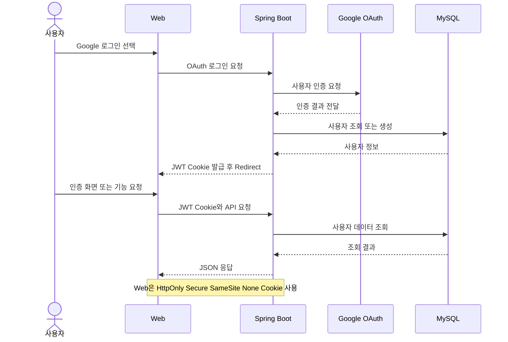
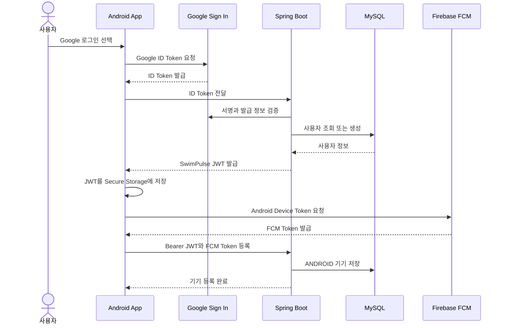
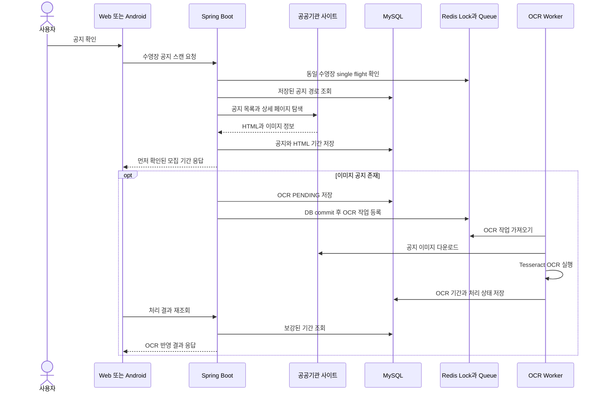
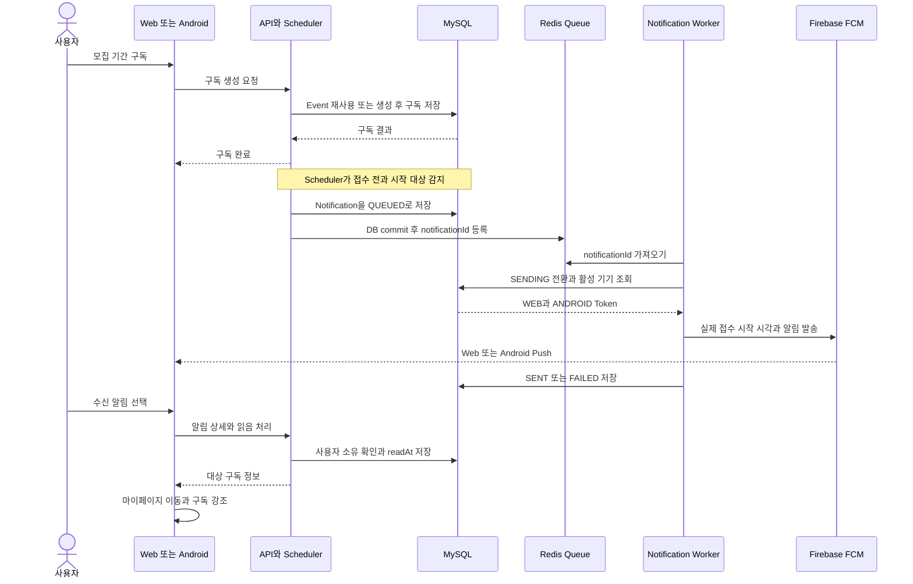

# 063 SwimPulse Notion용 간소화 시퀀스 다이어그램

작성일: 2026-07-22

## 목적

기존 상세 시퀀스 다이어그램은 구현 검토 문서로는 유용하지만, Notion 포트폴리오에서는 participant와 메시지가 너무 많아 글자가 작아지는 문제가 있다.

이 문서는 다음 원칙으로 포트폴리오용 다이어그램을 다시 구성한다.

- 다이어그램 하나당 participant를 최대 7개로 제한한다.
- Controller, Security Filter, Service, Repository 같은 내부 계층을 각각 분리하지 않는다.
- Caddy, Spring Security, Keychain 같은 세부 구현은 메시지나 핵심 설명에 표시한다.
- 정상 흐름과 핵심 예외만 남기고 세부 fallback은 보고서 링크로 분리한다.
- `autonumber`를 제거해 작은 화면의 시각적 밀도를 낮춘다.

---

## 1. 웹 로그인 및 인증 API 요청



### 핵심 설명

- Vercel에서 제공된 Web 화면이 HTTPS API를 호출한다.
- Spring Security가 공개 API와 인증 API를 구분하고 JWT Cookie를 검증한다.
- 브라우저 JavaScript가 JWT 값을 직접 읽지 못하도록 `HttpOnly` Cookie를 사용한다.
- Caddy는 앞단에서 HTTPS 종료와 Spring Boot reverse proxy를 담당한다.

---

## 2. 모바일 로그인과 FCM 기기 등록



### 핵심 설명

- Android OAuth Client는 package name과 SHA-1로 설치 앱을 식별한다.
- 백엔드는 Google ID Token을 검증한 뒤 자체 SwimPulse JWT를 발급한다.
- 모바일 API는 Cookie 대신 `Authorization: Bearer <JWT>`를 사용한다.
- JWT는 React Native Keychain을 통해 Android Keystore 영역에 저장한다.
- FCM Token은 로그인 JWT와 다른 값이며 설치된 기기를 식별하기 위해 `user_devices`에 저장한다.

---

## 3. 공지 확인과 백그라운드 OCR



### 핵심 설명

- Redis single-flight로 같은 수영장의 동시 스캔을 하나만 실행한다.
- HTML에서 찾은 기간은 사용자에게 먼저 응답한다.
- 무거운 Tesseract OCR은 요청 thread가 아닌 백그라운드 Worker에서 처리한다.
- 공지 row가 commit된 뒤 OCR 작업을 Queue에 넣어 아직 저장되지 않은 공지를 Worker가 읽는 문제를 막는다.
- 이 구조로 공지 확인 p99를 `13.37s`에서 `406.07ms`로 개선했다.

---

## 4. 기간 구독과 FCM 알림 발송



### 핵심 설명

- 공식 모집 기간은 여러 사용자가 같은 `registration_events` row를 재사용한다.
- Notification row를 source of truth로 두고 Redis에는 commit 이후 ID만 전달한다.
- dedupe key와 Unique Constraint로 Scheduler 반복 실행과 동시 요청의 중복 생성을 방지한다.
- Worker는 사용자에게 활성화된 WEB과 ANDROID Token 전체로 fan-out한다.
- 오래 `SENDING`에 머문 알림은 stale requeue로 다시 처리한다.
- Worker batch와 delay를 조정해 500명 fan-out 완료 시간을 `32.85s`에서 `10.10s`로 개선했다.

---

## Notion 배치 권장안

### 본문에 바로 노출

1. `공지 확인과 백그라운드 OCR`
2. `기간 구독과 FCM 알림 발송`

두 다이어그램은 SwimPulse의 핵심인 비정형 데이터 처리, 비동기 Worker, 데이터 정합성, 알림 복구 구조를 가장 잘 보여준다.

### 접기 영역에 배치

1. `웹 로그인 및 인증 API 요청`
2. `모바일 로그인과 FCM 기기 등록`

인증 흐름은 중요하지만 프로젝트의 차별점보다는 지원 기능에 가깝다. Notion의 Toggle 안에 넣으면 본문 길이를 줄이면서 필요한 독자는 상세 내용을 확인할 수 있다.

### Notion 표시 설정

- 페이지를 `Full width`로 설정한다.
- Mermaid 블록을 2단 Column 안에 넣지 않는다.
- 다이어그램 하나와 핵심 설명을 한 묶음으로 배치한다.
- 상세 클래스·메서드 단위 흐름은 기존 `062` 보고서 또는 GitHub 문서 링크로 제공한다.

## 최종 판단

포트폴리오에서는 모든 구현 단계를 한 장에 담는 것보다, 핵심 설계 판단이 읽히는 수준까지만 보여주는 것이 좋다.

```text
Notion 포트폴리오: 간소화 다이어그램
GitHub 및 기술 보고서: 기존 상세 다이어그램
면접 설명: 상세 다이어그램을 근거로 예외·복구 흐름 설명
```
