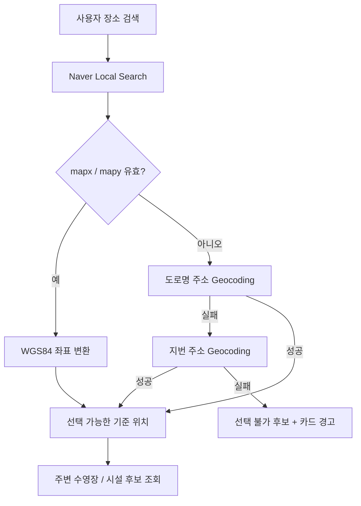

# 064 기준 장소 검색 좌표 fallback 개선

작성일: 2026-07-28

## 문제

기준 장소 검색은 Naver Local Search에서 후보를 찾은 뒤 후보의 도로명 주소를 Geocoding API에 다시 전달했다.
Local Search가 반환한 주소를 Geocoding이 해석하지 못하면 `No coordinates found for address.`가 발생했고,
프론트에서는 일반적인 `400` 오류 문구만 표시했다.

또한 Local Search 응답에는 `mapx`, `mapy`가 있었지만 기존 코드는 이를 버리고 있었다.
Geocoding 실패 결과는 Redis에 하루 동안 저장되어 같은 후보가 장시간 반복해서 실패할 수 있었다.

## 개선된 데이터 흐름



## 구현 내용

### Local Search 좌표 우선 사용

- `mapx`, `mapy`를 WGS84 경도·위도로 변환한다.
- 네이버 정수 좌표는 `10,000,000`으로 나누고 이미 소수 좌표이면 그대로 사용한다.
- 빈 값, 숫자가 아닌 값, `0`, 위경도 범위를 벗어난 값은 무효 처리한다.
- 좌표가 있으면 별도의 Geocoding 요청 없이 기준 위치로 사용한다.

### 주소 fallback

- Local Search 좌표가 없는 후보만 Geocoding한다.
- `roadAddress`를 먼저 시도한다.
- 실패하면 서로 다른 `address` 지번 주소를 다시 시도한다.
- 한 후보의 좌표 탐색 실패가 전체 검색 요청을 실패시키지 않는다.
- 최종 실패 후보는 `latitude`, `longitude`를 `null`로 유지한다.

### Web / Android UX

- 좌표가 없는 후보의 선택 버튼을 비활성화한다.
- 후보 카드에 `선택 불가` 라벨을 표시한다.
- `위치 좌표를 확인하지 못했습니다. 다른 결과를 선택해주세요.` 경고를 카드 안에 표시한다.
- 팝업이나 공통 오류 알림을 띄우지 않으므로 다른 후보를 바로 선택할 수 있다.
- 좌표가 있는 후보는 후보에 포함된 좌표로 주변 수영장 조회를 바로 시작한다.

### 캐시

| 캐시 | 변경 |
|---|---|
| Local Search | `swimpulse:cache:location-search:v1` → `v2` |
| 시설 후보 Search | `swimpulse:cache:pool-location-candidates:v1` → `v2` |
| Geocoding | `swimpulse:cache:geocode:v1` → `v2` |
| Geocoding 실패 TTL | `P1D` → `PT1H` |

캐시 키를 변경했기 때문에 운영 Redis의 기존 `v1` 실패 캐시를 수동 삭제하지 않아도 새 코드가 즉시 `v2`를 사용한다.
기존 키는 TTL이 끝나면 자동으로 제거된다.

운영에서 필요하면 다음 환경변수를 명시할 수 있다.

```dotenv
SWIMPULSE_CACHE_GEOCODE_FAILURE_TTL=PT1H
```

## 테스트 결과

- Local Search 정수 WGS84 좌표 변환 테스트
- 이미 소수인 좌표 유지 테스트
- 빈 값, 잘못된 값, 범위 밖 좌표 거부 테스트
- Local Search 좌표가 있으면 Geocoding을 호출하지 않는 테스트
- 도로명 주소 실패 후 지번 주소 성공 테스트
- 두 주소가 모두 실패해도 후보 목록을 유지하는 테스트
- 백엔드 전체 `gradlew test` 통과
- 프론트엔드 ESLint 및 Next.js production build 통과
- 모바일 TypeScript, ESLint, Jest 통과

## 운영 반영

백엔드 변경이 있으므로 운영 배포가 필요하다. GitHub Actions 배포가 완료되면 새 `v2` 캐시가 사용된다.
Vercel 프론트는 GitHub push 후 자동 배포되고, Android 앱은 다음 debug/release 빌드부터 변경 UI가 포함된다.
