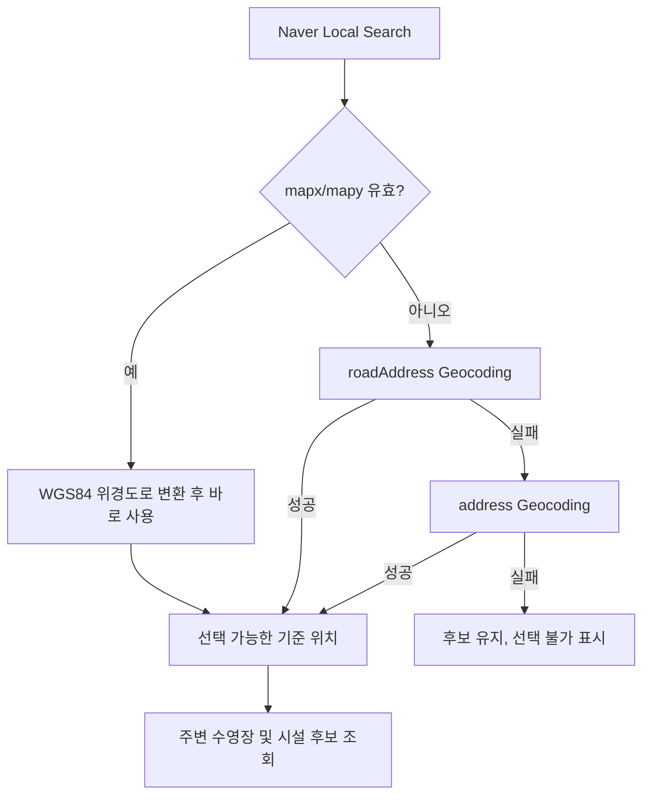

# 065 지난 모집 기간 구독 및 기준 장소 좌표 처리 개선

작성일: 2026-07-28

## 목적

사용자 흐름을 막던 다음 두 문제를 개선했다.

1. 이미 종료된 모집 기간을 구독하려 하면 기술적인 `400 Bad Request`로 끝나는 문제
2. 기준 장소 검색 결과에 좌표가 있어도 주소 Geocoding 실패 하나로 장소 선택이 막히는 문제

두 경우 모두 서버의 데이터 정합성 검증은 유지하되, 사용자가 다음 행동을 이해하고 선택할 수 있도록 Web과 Android UI를 보완하는 방향을 선택했다.

---

## 이슈 1. 종료된 모집 기간 구독

### 문제 상황

예를 들어 현재가 7월 28일인데 공지에서 `7월 20일 ~ 7월 24일` 기간을 찾은 경우, 사용자가 `이 기간 구독`을 누르면 공식 공지 기간의 종료 시각이 현재보다 과거이므로 백엔드는 아래 검증에서 요청을 거절했다.

```text
POST /api/subscriptions
400 Bad Request
Cannot subscribe to an already closed registration period.
```

이는 이미 종료된 공식 이벤트에 알림을 만들지 않기 위한 정상적인 서버 방어이지만, 기존 Web/Android 화면은 공통 오류 문구만 보여 주어 사용자는 왜 안 되는지와 다음에 무엇을 할 수 있는지 알기 어려웠다.

### 원인

공식 공지에서 추출된 `notice_registration_periods`는 실제 공지 기간이다. 이를 기반으로 만든 `registration_events`와 알림은 이미 종료된 시각에 대해 생성하면 의미가 없고, 잘못하면 과거 일정에 대한 알림 상태만 남긴다.

기존에는 과거 기간을 현재 달 날짜로 옮기는 UI 보정이 있었지만, 현재 달의 같은 날짜도 이미 지났다면 여전히 종료된 기간이 될 수 있었다.

### 검토한 방식

| 방식 | 장점 | 단점 |
|---|---|---|
| 서버가 종료된 공식 기간도 그대로 구독 허용 | 구현이 단순 | 과거 이벤트와 알림이 생성되어 데이터 의미가 무너짐 |
| 서버가 다음 달 공식 이벤트로 자동 변경 | 클릭 한 번으로 처리 | 실제 공지가 아직 없는 상태인데 공식 공지처럼 보일 수 있음 |
| 서버 오류만 사용자 문구로 치환 | 최소 수정 | 사용자가 대안을 선택할 수 없음 |
| 클라이언트가 미래 사용자 지정 기간을 제안하고, 사용자가 확인 후 별도 구독 생성 | 공식 공지와 임의 알림을 구분하고 선택권 제공 | UI와 날짜 계산이 추가로 필요 |

### 선택한 방식과 이유

`클라이언트 확인 모달 + 미래 사용자 지정 구독`을 선택했다.

1. 공지 기간이 이미 닫혔는지 Web/Android에서 먼저 판단한다.
2. 다음에 도래하는 같은 날짜 범위를 서울 시간 기준으로 계산한다.
3. `이미 지난 모집 기간입니다. 8월(다음 달) 공지를 기다리시거나 8월 같은 날짜에 알림을 등록할까요?`를 안내한다.
4. 사용자가 `새 공지 기다리기`를 선택하면 아무 데이터도 만들지 않는다.
5. 사용자가 미래 날짜 등록을 선택하면 `noticeRegistrationPeriodId=null`로 전송하여, 공식 공지 이벤트가 아닌 사용자 지정 이벤트/구독을 만든다.
6. 제목과 안내 문구에 사용자 지정 알림임을 표시한다.

이 방식은 실제 공지 기반 이벤트의 신뢰도를 보존한다. 서버는 직접 호출이나 오래된 앱에서 종료된 공식 기간을 보내도 계속 `400`으로 거절하므로, UI 보정이 정합성 방어를 약화시키지 않는다.

### 구현 범위

| 영역 | 변경 |
|---|---|
| Backend | 종료된 `noticeRegistrationPeriodId` 공식 구독은 계속 거절하고 테스트로 고정 |
| Web | 종료 기간 클릭 시 다음 가능한 월의 사용자 지정 알림 확인 모달 표시 |
| Android | 동일한 확인 다이얼로그와 사용자 지정 제목/기간 전송 |
| 날짜 유틸 | 서울 시간대 기준으로 다음 가능한 같은 날짜 범위를 계산 |
| 오류 메시지 | 직접 API 호출 등 예외 경로도 한글 안내 문구로 매핑 |

### 추가 개선 후보

- 사용자 지정 알림에 `MANUAL_ESTIMATE` 같은 명시적 출처 필드를 추가해 관리자/마이페이지에서 공식 공지와 더 선명하게 구분할 수 있다.
- 새 공식 공지가 도착했을 때 같은 수영장과 유사한 사용자 지정 구독에 연결 또는 비교 안내를 제공할 수 있다.
- 월말 날짜(`31일`)를 짧은 달로 옮기는 정책을 UI에 한 줄로 노출하거나, 사용자가 날짜를 직접 조정하도록 확장할 수 있다.

---

## 이슈 2. 기준 장소 검색 좌표 실패

### 문제 상황

기준 장소 검색에서 Naver Local Search가 시설 후보를 반환했지만, 선택 순간 후보의 주소를 다시 Naver Maps Geocoding API에 전달했다. 주소 표기 차이로 Geocoding이 좌표를 찾지 못하면 다음처럼 전체 요청이 실패했다.

```text
GET /api/locations/geocode
400 Bad Request
No coordinates found for address.
```

Web/Android는 이를 일반적인 `요청을 처리하지 못했습니다. 입력값을 확인해주세요.`로 보여 주었다. 또한 Geocoding 실패 캐시는 하루 동안 유지되어 같은 후보가 오래 반복 실패할 수 있었다.

### 원인

Naver Local Search 응답에는 이미 `mapx`, `mapy`가 포함될 수 있는데, 기존 구현은 이 값을 DTO에 반영하지 않고 `roadAddress` 또는 `address`를 다시 Geocoding했다.

즉, 한 번의 검색에서 이미 확보한 좌표를 버리고 주소 문자열 해석이라는 더 취약한 단계를 추가한 구조였다. 실패한 단일 후보가 장소 검색 전체 흐름의 실패로 이어진 점도 문제였다.

### 검토한 방식

| 방식 | 장점 | 단점 |
|---|---|---|
| 모든 후보를 주소 Geocoding만 사용 | 기존 구조 유지 | 주소 표기 차이에 계속 취약, 불필요한 외부 호출 |
| Local Search `mapx/mapy`를 우선 사용 | 외부 호출 감소, 검색 결과와 좌표가 일관됨 | 좌표가 없는 예외 후보 처리 필요 |
| 좌표가 없으면 후보 자체를 API에서 제거 | 선택 가능한 결과만 보임 | 사용자가 검색 결과를 보지 못하고 원인을 알기 어려움 |
| 좌표가 없으면 roadAddress, address 순으로 fallback 후 최종 후보 유지 | 성공률과 사용자 선택권을 함께 확보 | fallback 정책과 UI 상태가 추가됨 |
| 모든 실패를 공통 alert로 표시 | 구현 단순 | 다른 정상 후보까지 고르기 불편함 |

### 선택한 방식과 이유

`Local Search 좌표 우선 + 주소 fallback + 선택 불가 후보 유지`를 선택했다.



선택 이유는 다음과 같다.

- Local Search 좌표가 있으면 재-Geocoding을 생략해 지연과 실패 가능성을 줄인다.
- `mapx/mapy`는 변환 후 WGS84 경도/위도이므로 주변 검색 API에서 쓰는 좌표와 같은 단위로 사용할 수 있다.
- 좌표가 없는 후보만 도로명 주소, 지번 주소 순으로 보완하므로 성공률을 높인다.
- 주소를 임의로 `행정동` 제거 같은 방식으로 정규화하지 않았다. 잘못된 정규화가 정상 주소를 다른 위치로 바꾸는 위험이 더 크기 때문이다.
- 최종 실패 후보도 목록에서 숨기지 않고 `선택 불가`와 이유를 카드 안에 표시한다. 사용자는 다른 후보를 곧바로 고를 수 있다.

### 캐시 정책

| 항목 | 이전 | 변경 |
|---|---|---|
| Local Search 캐시 키 | `v1` | `v2` |
| 시설 후보 검색 캐시 키 | `v1` | `v2` |
| Geocoding 캐시 키 | `v1` | `v2` |
| Geocoding 실패 TTL | `P1D` | `PT1H` |

키를 `v2`로 올려 기존의 부정확한 실패 캐시를 수동 삭제하지 않고 우회한다. 실패 TTL은 1시간으로 줄여 주소 데이터나 외부 API 상태가 바뀐 경우 재시도 기회를 빠르게 제공한다.

### 구현 범위

| 영역 | 변경 |
|---|---|
| Local Search Client | `mapx/mapy`를 기존 `latitude/longitude` DTO 필드로 변환, 값 검증 추가 |
| Location/Pool Service | 좌표 보유 후보는 즉시 사용, 없는 후보만 도로명 후 지번 Geocoding |
| Web/Android | 좌표 없는 후보를 비활성화하고 한글 경고 문구 표시 |
| 오류 메시지 | Geocoding 직접 호출 예외도 사용자용 문구로 매핑 |
| Cache | 키 버전 `v2`, 실패 TTL 1시간 |

### 추가 개선 후보

- 후보 좌표 품질이 의심되는 경우 거리/행정구역 검증을 추가할 수 있다.
- 정규화가 꼭 필요해지면 원본 도로명 주소를 먼저 시도한 뒤, 제한된 규칙의 보조 변형만 추가해야 한다. 원본을 덮어쓰면 안 된다.
- 외부 API별 성공률, fallback 비율, 선택 불가 후보 수를 Prometheus 지표로 기록하면 특정 지역 데이터 품질 문제를 빠르게 찾을 수 있다.

---

## 테스트 및 운영 반영

### 자동 테스트

- 종료된 공식 기간 구독 거절 테스트
- 미래 사용자 지정 기간 구독 생성 테스트
- Local Search 정수 좌표 변환, 소수 좌표 유지, 잘못된 좌표 거부 테스트
- Local Search 좌표가 있으면 Geocoding을 호출하지 않는 테스트
- 도로명 실패 후 지번 성공 테스트
- 두 주소가 실패해도 후보 목록을 유지하는 테스트
- Backend 전체 `gradlew test` 통과
- Frontend ESLint 및 production build 통과
- Android TypeScript, ESLint, Jest 통과

### 배포 순서

1. 변경사항과 본 문서를 커밋하고 `main`에 push한다.
2. GitHub Actions 백엔드 배포가 완료되면 Location/Geocoding `v2` 캐시와 1시간 실패 TTL이 적용된다.
3. Vercel은 Web 변경을 자동 배포한다.
4. Android는 debug/release APK를 다시 빌드 및 설치해야 UI 변경이 반영된다.

## 결론

두 개선 모두 실패를 억지로 숨기거나 서버 검증을 완화하지 않았다. 종료된 실제 공지 기간은 계속 보호하고, 사용자가 원할 때만 명확히 표시된 미래 사용자 지정 알림을 만들게 했다. 장소 검색도 좌표가 있는 정상 후보를 먼저 살리고, 끝까지 좌표를 찾지 못한 후보만 선택 불가로 분리했다.

그 결과 정합성은 유지하면서도 사용자는 실패 이유와 가능한 다음 행동을 화면에서 바로 이해할 수 있게 됐다.
